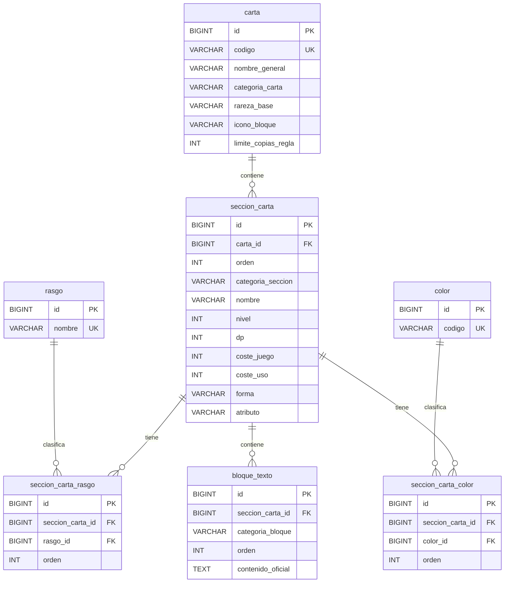

# PaginaTCG

PaginaTCG es una biblioteca y futura herramienta avanzada de búsqueda para el **Digimon Card Game**. El objetivo es permitir encontrar cartas mediante filtros precisos sobre datos estructurados, evitando que el usuario tenga que revisar manualmente miles de cartas.

El proyecto está en una fase temprana centrada en construir correctamente el backend, el esquema de base de datos y el modelo del catálogo de cartas. La interfaz podrá ser bilingüe para usuarios hispanohablantes y angloparlantes, pero el contenido oficial de las cartas se almacenará inicialmente en inglés.

Repositorio remoto: <https://github.com/JotillaFT/PaginaTCG.git>

## Estado actual

Implementado actualmente:

- Backend Spring Boot en `backend/`.
- Configuración de MySQL mediante Docker Compose.
- Flyway como gestor de migraciones.
- Migraciones V1 a V5 aplicadas al modelo inicial de cartas.
- Entidades JPA para cartas, secciones, rasgos, colores y bloques de texto.
- `CartaRepository`, basado en `JpaRepository<Carta, Long>`.
- Búsqueda derivada `findByCodigo(String codigo)`.
- Tests de integración básicos con Spring Boot y MySQL real.
- Validación del esquema con Hibernate al arrancar.

No implementado todavía:

- Importador de Heroicc.
- Datos reales del catálogo.
- Servicios de aplicación.
- Controladores REST o endpoints de cartas.
- Frontend Angular funcional. Existe una carpeta `frontend/`, pero actualmente no contiene una implementación.
- Autenticación, usuarios, colecciones personales o mazos.
- Impresiones, lanzamientos, evoluciones estructuradas, Link estructurado, etiquetas de efecto, palabras clave, restricciones completas o erratas completas.

## Objetivos y alcance

El alcance inicial es una biblioteca de cartas con un modelo de datos sólido para búsqueda avanzada. La prioridad actual es representar correctamente la identidad de las cartas y los datos necesarios para futuros filtros.

No se pretende crear inicialmente:

- Un blog.
- Una wiki de rulings.
- Un sistema de preguntas y respuestas.
- Traducciones manuales de todos los textos oficiales.
- Un constructor de mazos en la primera fase.

Los usuarios, colecciones personales y mazos se plantean como módulos posteriores relacionados con el catálogo, sin modificar la identidad básica de las cartas.

## Tecnologías

- Java 25.
- Spring Boot 4.1.1.
- Gradle Wrapper con Gradle 9.5.1.
- Spring Data JPA.
- Hibernate.
- Flyway.
- MySQL 8.4.11.
- Docker Compose.
- JUnit 5 / JUnit Platform.

Dependencias principales del backend:

- `spring-boot-starter-data-jpa`
- `spring-boot-starter-flyway`
- `spring-boot-starter-validation`
- `spring-boot-starter-webmvc`
- `flyway-mysql`
- `mysql-connector-j`

## Estructura del repositorio

```text
PaginaTCG/
├── backend/
│   ├── build.gradle
│   ├── settings.gradle
│   ├── docker-compose.yml
│   ├── gradlew / gradlew.bat
│   └── src/
│       ├── main/
│       │   ├── java/com/jotilla/paginatcg/
│       │   │   ├── entity/
│       │   │   └── repository/
│       │   └── resources/
│       │       ├── application.properties
│       │       └── db/migration/
│       └── test/java/com/jotilla/paginatcg/
└── frontend/
```

Paquete principal de Java:

```text
com.jotilla.paginatcg
```

## Requisitos previos

- JDK 25.
- Docker y Docker Compose.
- Acceso a una terminal.
- Opcional: IntelliJ IDEA para desarrollo Java y DataGrip para inspeccionar MySQL.

No es necesario instalar Gradle globalmente; el proyecto incluye Gradle Wrapper.

## Configuración de entorno

El backend carga variables desde `backend/.env` mediante:

```properties
spring.config.import=optional:file:./.env[.properties]
```

Crea un archivo `backend/.env` con valores propios:

```properties
PAGINA_TCG_DB_PASSWORD=pon_aqui_una_contraseña_de_aplicacion
PAGINA_TCG_ROOT_PASSWORD=pon_aqui_una_contraseña_de_root
```

No subas credenciales reales al repositorio.

## Base de datos

La base de datos se ejecuta con Docker Compose desde `backend/`.

Configuración actual:

- Contenedor: `pagina-tcg-mysql`
- Imagen: `mysql:8.4.11`
- Base de datos: `pagina_tcg`
- Usuario de aplicación: `pagina_tcg_user`
- Puerto del host: `3307`
- Puerto interno del contenedor: `3306`
- Volumen persistente: `pagina_tcg_mysql_data`
- URL JDBC: `jdbc:mysql://localhost:3307/pagina_tcg`

Arranque:

```powershell
docker compose up -d
```

Parada:

```powershell
docker compose down
```

Evita `docker compose down -v` salvo que quieras eliminar deliberadamente el volumen `pagina_tcg_mysql_data` y perder los datos almacenados en MySQL.

## Ejecución del backend

Desde `backend/`, en Windows PowerShell:

```powershell
.\gradlew bootRun
```

En Linux o macOS:

```bash
./gradlew bootRun
```

El backend arranca con la configuración actual en el puerto `8080`.

## Tests

Desde `backend/`, en Windows PowerShell:

```powershell
.\gradlew test
```

En Linux o macOS:

```bash
./gradlew test
```

Los tests actuales arrancan Spring Boot y utilizan MySQL real. `CartaRepositoryTest` guarda una carta de prueba `TEST-001`, fuerza el `INSERT` con `saveAndFlush()`, la recupera con `findByCodigo()` y usa `@Transactional` para hacer rollback al finalizar.

## Estrategia de base de datos

Flyway es el único responsable de evolucionar el esquema de base de datos. Hibernate está configurado con:

```properties
spring.jpa.hibernate.ddl-auto=validate
spring.jpa.open-in-view=false
```

Esto implica:

- Flyway crea y modifica las tablas.
- Hibernate solo valida que las entidades coincidan con el esquema de MySQL.
- Hibernate no debe crear ni alterar automáticamente el esquema.
- Una migración aplicada no se edita.
- Los cambios posteriores se hacen con nuevas migraciones, por ejemplo `V6`, `V7`, etc.

Esta decisión es central para mantener controlado el modelo de datos desde las primeras fases del proyecto.

## Modelo implementado

### Migraciones actuales

- `V1__crear_tabla_carta.sql`: crea `carta`, que representa la identidad lógica de una carta. Incluye `id` interno, `codigo` oficial único, `nombre_general`, `categoria_carta`, `rareza_base`, `icono_bloque` y `limite_copias_regla` con valor predeterminado `4`.
- `V2__crear_tabla_seccion_carta.sql`: crea `seccion_carta`. Una carta normal tendrá normalmente una sección; una carta `DUAL` podrá tener varias secciones funcionales. Usa `NULL` para atributos que no existan, como `nivel`, `dp` o costes.
- `V3__crear_tablas_rasgo.sql`: crea `rasgo` y `seccion_carta_rasgo`. Los rasgos son catálogo reutilizable y la relación conserva el `orden` oficial.
- `V4__crear_tablas_color.sql`: crea `color` y `seccion_carta_color`. Los colores son relacionales, no columnas numeradas ni texto separado por comas. La migración carga `RED`, `BLUE`, `YELLOW`, `GREEN`, `BLACK`, `PURPLE` y `WHITE`.
- `V5__crear_tabla_bloque_texto.sql`: crea `bloque_texto`. Cada fila representa una caja oficial completa de texto asociada a una sección, con `contenido_oficial` como fuente de verdad.

### Entidades y enums

Entidades actuales:

- `Carta`
- `SeccionCarta`
- `Rasgo`
- `SeccionCartaRasgo`
- `ColorCarta`
- `SeccionCartaColor`
- `BloqueTexto`

Enums actuales:

- `CategoriaCarta`: `DIGIMON`, `DIGI_EGG`, `TAMER`, `OPTION`, `DUAL`, `TOKEN`
- `CategoriaBloqueTexto`: `EFFECT`, `INHERITED_EFFECT`, `SECURITY_EFFECT`, `RULE`, `LINK_EFFECT`

Las relaciones `ManyToOne` usan `FetchType.LAZY`. Los enums se almacenan como texto y las entidades usan `@JdbcTypeCode(SqlTypes.VARCHAR)` donde corresponde para que Hibernate espere `VARCHAR` en MySQL.

### Esquema actual



## Decisiones principales del modelo

- Los nombres de tablas y columnas están en español y `snake_case`.
- Las clases Java del dominio usan nombres en español cuando representan conceptos propios del proyecto.
- Valores internos estables como `DIGIMON`, `EFFECT` o `RED` se mantienen en inglés y mayúsculas.
- MySQL usa `utf8mb4` y `utf8mb4_0900_ai_ci`.
- `id` es el identificador interno de MySQL; `codigo` es el número oficial visible para el usuario, por ejemplo `BT5-086`.
- Los textos oficiales de cartas se conservan completos en inglés.
- `forma`, `atributo` y `rasgo` son conceptos separados.
- Los rasgos y colores se modelan como relaciones reutilizables, no como columnas numeradas ni listas separadas por comas.
- Los atributos que no existen se guardan como `NULL`; no se usan valores artificiales como `0`, `-1` o `"-"` para expresar ausencia.
- `nivel`, `dp` y costes se representan con `Integer` en Java para conservar correctamente los `NULL`.
- `CategoriaCarta.DUAL` representa una carta con varias secciones funcionales; cada `SeccionCarta` conserva su categoría concreta.
- `CategoriaBloqueTexto.EFFECT` representa la caja normal de efectos. No se llama `MAIN` porque `[Main]` es una etiqueta oficial de activación que se modelará aparte.
- Cada `BloqueTexto` guarda una caja oficial completa. Las etiquetas futuras indicarán presencia dentro del bloque, sin dividir inicialmente cada frase o efecto individual.

## Fuente de datos prevista

La fuente principal prevista es la API y el Bulk Data de Heroicc:

- Documentación general: <https://heroi.cc/docs/api>
- Cards API: <https://heroi.cc/docs/api/cards>

Heroicc documenta datos como `number`, `category`, `level`, `dp`, `play-cost`, `use-cost`, `form`, `attribute`, `type`, `color`, efectos, imágenes, lanzamientos, erratas y limitaciones.

La importación no está implementada todavía. La estrategia prevista es empezar con una muestra curada de unas 50-100 cartas que cubra casos variados, validar el mapeo y después importar el catálogo completo con comprobaciones automáticas de duplicados, campos obligatorios, relaciones huérfanas, valores desconocidos, conteos por categoría y errores de conversión.

Tratamiento previsto de algunos campos:

- `level` numérico se convertirá a `Integer`.
- `level` ausente o `null` se convertirá a `NULL`.
- Como protección, valores visuales como `"-"` se tratarán como ausencia si apareciesen en alguna fuente futura.
- `type` se dividirá por `/` para obtener rasgos reutilizables.
- `color` se relacionará con el catálogo `color`.
- El idioma inicial de importación será inglés.

## Roadmap

Planificado, pero no implementado todavía:

- Importador desde Heroicc API / Bulk Data.
- Carga de una muestra curada y posterior importación completa del catálogo.
- Modelo de impresiones y lanzamientos para imágenes, artes alternativos, reimpresiones, productos y fechas.
- Evoluciones normales estructuradas.
- Conservación de evoluciones especiales en texto oficial, con detección posterior mediante etiquetas o búsqueda textual.
- Link estructurado: requisitos, coste, bonificación de DP, efecto y etiquetas relacionadas.
- Catálogo de etiquetas de efecto y relación con `bloque_texto`, por ejemplo `MAIN`, `DELAY`, `ON_PLAY`, `WHEN_DIGIVOLVING`, `WHEN_ATTACKING`, `ALL_TURNS`, `ON_DELETION`, `WHEN_LINKING` o `SECURITY`.
- Palabras clave propias como datos estructurados y palabras clave mencionadas o concedidas mediante búsqueda de texto.
- Restricciones completas, pares prohibidos y erratas.
- API REST para consulta de cartas.
- Frontend Angular para búsqueda avanzada.
- Usuarios, colecciones personales y mazos como módulos posteriores.

Filtros previstos para la búsqueda avanzada:

- Código oficial, nombre, categoría, rareza, nivel, DP, coste, forma y atributo.
- Uno o varios rasgos.
- Uno o varios colores, con modos "contiene todos", "contiene cualquiera" o "exactamente esta combinación".
- Categoría del bloque de texto y etiquetas de activación.
- Palabras clave propias, mencionadas o concedidas.
- Evolución normal y detección textual de evoluciones especiales.
- Disponibilidad, restricciones o productos cuando existan esas tablas.

## Atribución y no afiliación

Este proyecto no está afiliado, respaldado ni patrocinado por Bandai, Toei Animation o Akiyoshi Hongo. Los nombres, cartas, imágenes, símbolos y demás propiedad intelectual de **Digimon** y **Digimon Card Game** pertenecen a sus respectivos titulares.

La fuente de datos prevista es Heroicc. Según su documentación de uso de datos e imágenes, Heroicc tampoco está afiliado, respaldado ni conectado con Akiyoshi Hongo, Toei Animation o Bandai; los datos e imágenes oficiales siguen perteneciendo a sus titulares; y las imágenes de cartas no deben recortarse para eliminar copyright o nombre de artista ni modificarse con marcas de agua, sellos o logotipos propios.

Antes de usar datos o imágenes en una versión pública, revisa la documentación vigente de Heroicc:

- <https://heroi.cc/docs/api>
- <https://heroi.cc/docs/api/cards>

No se afirma ninguna licencia sobre imágenes o datos oficiales que no corresponda.
