# PaginaTCG — nombre provisional

> [!NOTE]
> `PaginaTCG` es el nombre técnico y provisional del proyecto. El nombre público de la aplicación se decidirá más adelante.

Este proyecto es una biblioteca y futura herramienta avanzada de búsqueda para el **Digimon Card Game**. El objetivo es permitir encontrar cartas mediante filtros precisos sobre datos estructurados, evitando que el usuario tenga que revisar manualmente miles de cartas.

El proyecto está en una fase temprana centrada en construir correctamente el backend, el esquema de base de datos y el modelo del catálogo de cartas. La interfaz podrá ser bilingüe para usuarios hispanohablantes y angloparlantes, pero el contenido oficial de las cartas se almacenará inicialmente en inglés.

Repositorio remoto: <https://github.com/JotillaFT/PaginaTCG.git>

La explicación detallada del esquema, sus relaciones y las migraciones está disponible en [docs/backend/modelo-datos.md](docs/backend/modelo-datos.md).

## Estado actual

Implementado actualmente:

- Backend Spring Boot en `backend/`.
- Configuración de MySQL mediante Docker Compose.
- Flyway como gestor de migraciones.
- Migraciones V1 a V12 implementadas, aplicadas y validadas para el modelo de cartas.
- Entidades JPA para el contenido funcional de las cartas, sus requisitos de evolución, Link, idiomas, impresiones, lanzamientos, ilustradores, restricciones competitivas y erratas.
- `CartaRepository`, basado en `JpaRepository<Carta, Long>`.
- Búsqueda derivada `findByCodigo(String codigo)`.
- Tests de integración básicos con Spring Boot y MySQL real.
- Validación del esquema con Hibernate al arrancar.

No implementado todavía:

- Importador de Heroicc.
- Datos reales del catálogo.
- Servicios de aplicación.
- Controladores REST o endpoints de cartas.
- Frontend Angular funcional. Existe una carpeta `frontend/`, pero actualmente no contiene una implementación.
- Autenticación, usuarios, colecciones personales o mazos.
- Datos reales importados de restricciones competitivas o erratas.

## Objetivos y alcance

El alcance inicial es una biblioteca de cartas con un modelo de datos sólido para búsqueda avanzada. La prioridad actual es representar correctamente la identidad de las cartas y los datos necesarios para futuros filtros.

No se pretende crear inicialmente:

- Un blog.
- Una wiki de rulings.
- Un sistema de preguntas y respuestas.
- Traducciones manuales de todos los textos oficiales.
- Un constructor de mazos en la primera fase.

Los usuarios, colecciones personales y mazos se plantean como módulos posteriores relacionados con el catálogo, sin modificar la identidad básica de las cartas.

## Tecnologías

- Java 25.
- Spring Boot 4.1.1.
- Gradle Wrapper con Gradle 9.5.1.
- Spring Data JPA.
- Hibernate.
- Flyway.
- MySQL 8.4.11.
- Docker Compose.
- JUnit 5 / JUnit Platform.

Dependencias principales del backend:

- `spring-boot-starter-data-jpa`
- `spring-boot-starter-flyway`
- `spring-boot-starter-validation`
- `spring-boot-starter-webmvc`
- `flyway-mysql`
- `mysql-connector-j`

## Estructura del repositorio

```text
PaginaTCG/
|-- README.md
|-- AGENTS.md
|-- docs/
|   `-- backend/
|       `-- modelo-datos.md
|-- backend/
|   |-- build.gradle
|   |-- settings.gradle
|   |-- docker-compose.yml
|   |-- gradlew / gradlew.bat
|   `-- src/
|       |-- main/
|       |   |-- java/com/jotilla/paginatcg/
|       |   |   |-- entity/
|       |   |   `-- repository/
|       |   `-- resources/
|       |       |-- application.properties
|       |       `-- db/migration/
|       `-- test/java/com/jotilla/paginatcg/
`-- frontend/
```

Paquete principal de Java:

```text
com.jotilla.paginatcg
```

## Requisitos previos

- JDK 25.
- Docker y Docker Compose.
- Acceso a una terminal.
- Opcional: IntelliJ IDEA para desarrollo Java y DataGrip para inspeccionar MySQL.

No es necesario instalar Gradle globalmente; el proyecto incluye Gradle Wrapper.

## Configuración de entorno

El backend carga variables desde `backend/.env` mediante:

```properties
spring.config.import=optional:file:./.env[.properties]
```

Crea un archivo `backend/.env` con valores propios:

```properties
PAGINA_TCG_DB_PASSWORD=pon_aqui_una_contraseña_de_aplicacion
PAGINA_TCG_ROOT_PASSWORD=pon_aqui_una_contraseña_de_root
```

No subas credenciales reales al repositorio.

## Base de datos

La base de datos se ejecuta con Docker Compose desde `backend/`.

Configuración actual:

- Contenedor: `pagina-tcg-mysql`
- Imagen: `mysql:8.4.11`
- Base de datos: `pagina_tcg`
- Usuario de aplicación: `pagina_tcg_user`
- Puerto del host: `3307`
- Puerto interno del contenedor: `3306`
- Volumen persistente: `pagina_tcg_mysql_data`
- URL JDBC: `jdbc:mysql://localhost:3307/pagina_tcg`

Arranque:

```powershell
docker compose up -d
```

Parada:

```powershell
docker compose down
```

Evita `docker compose down -v` salvo que quieras eliminar deliberadamente el volumen `pagina_tcg_mysql_data` y perder los datos almacenados en MySQL.

## Ejecución del backend

Desde `backend/`, en Windows PowerShell:

```powershell
.\gradlew bootRun
```

En Linux o macOS:

```bash
./gradlew bootRun
```

El backend arranca con la configuración actual en el puerto `8080`.

## Tests

Desde `backend/`, en Windows PowerShell:

```powershell
.\gradlew test
```

En Linux o macOS:

```bash
./gradlew test
```

Los tests actuales arrancan Spring Boot y utilizan MySQL real. `CartaRepositoryTest` guarda una carta de prueba `TEST-001`, fuerza el `INSERT` con `saveAndFlush()`, la recupera con `findByCodigo()` y usa `@Transactional` para hacer rollback al finalizar.

## Estrategia de base de datos

Flyway es el único responsable de evolucionar el esquema de base de datos. Hibernate está configurado con:

```properties
spring.jpa.hibernate.ddl-auto=validate
spring.jpa.open-in-view=false
```

Esto implica:

- Flyway crea y modifica las tablas.
- Hibernate solo valida que las entidades coincidan con el esquema de MySQL.
- Hibernate no debe crear ni alterar automáticamente el esquema.
- Una migración aplicada no se edita.
- Los cambios posteriores se hacen con nuevas migraciones, por ejemplo `V13`, `V14`, etc.

Esta decisión es central para mantener controlado el modelo de datos desde las primeras fases del proyecto.

## Modelo implementado

### Migraciones actuales

- `V1__crear_tabla_carta.sql`: crea `carta`, que representa la identidad lógica de una carta. Incluye `id` interno, `codigo` oficial único, `nombre_general`, `categoria_carta`, `rareza_base`, `icono_bloque` y `limite_copias_regla` con valor predeterminado `4`.
- `V2__crear_tabla_seccion_carta.sql`: crea `seccion_carta`. Una carta normal tendrá normalmente una sección; una carta `DUAL` podrá tener varias secciones funcionales. Usa `NULL` para atributos que no existan, como `nivel`, `dp` o costes.
- `V3__crear_tablas_rasgo.sql`: crea `rasgo` y `seccion_carta_rasgo`. Los rasgos son catálogo reutilizable y la relación conserva el `orden` oficial.
- `V4__crear_tablas_color.sql`: crea `color` y `seccion_carta_color`. Los colores son relacionales, no columnas numeradas ni texto separado por comas. La migración carga `RED`, `BLUE`, `YELLOW`, `GREEN`, `BLACK`, `PURPLE` y `WHITE`.
- `V5__crear_tabla_bloque_texto.sql`: crea `bloque_texto`. Cada fila representa una caja oficial completa de texto asociada a una sección, con `contenido_oficial` como fuente de verdad.
- `V6__crear_tablas_etiqueta_efecto.sql`: crea `etiqueta_efecto` y `bloque_texto_etiqueta`. Las etiquetas de efecto son un catálogo extensible y la relación indica qué etiquetas están presentes en cada bloque sin dividir `contenido_oficial`.
- `V7__crear_tablas_palabra_clave.sql`: crea `palabra_clave` y `bloque_texto_palabra_clave`. Las palabras clave son un catálogo extensible y la relación indica qué palabras clave propias aparecen directamente en cada bloque.
- `V8__crear_formas_y_requisitos_evolucion_normal.sql`: crea el catálogo extensible `forma_carta`, sustituye el texto de forma de `seccion_carta` por `forma_carta_id` y crea `requisito_evolucion_normal` y `requisito_evolucion_normal_color` para representar alternativas normales de evolución.
- `V9__crear_impresiones_y_lanzamientos.sql`: crea `idioma`, `lanzamiento`, `impresion_carta`, `impresion_carta_lanzamiento`, `ilustrador` e `impresion_carta_ilustrador` para separar la identidad funcional de una carta de sus variantes físicas o gráficas.
- `V10__crear_informacion_link.sql`: crea `informacion_link`, `requisito_link` y `requisito_link_rasgo` para separar la estructura de la mecánica Link, sus requisitos y los efectos funcionales conservados en `bloque_texto`.
- `V11__crear_restricciones_competitivas.sql`: crea el catálogo `tipo_restriccion_competitiva`, las restricciones individuales de `restriccion_competitiva_carta` y los pares prohibidos de `restriccion_pareja`.
- `V12__crear_erratas.sql`: crea `errata_carta` para conservar correcciones oficiales de la carta funcional y `errata_impresion_carta` para identificar las impresiones físicas concretas que contienen el texto erróneo.

### Entidades y enums

Entidades actuales:

- `Carta`
- `SeccionCarta`
- `FormaCarta`
- `Rasgo`
- `SeccionCartaRasgo`
- `ColorCarta`
- `SeccionCartaColor`
- `BloqueTexto`
- `EtiquetaEfecto`
- `BloqueTextoEtiqueta`
- `PalabraClave`
- `BloqueTextoPalabraClave`
- `RequisitoEvolucionNormal`
- `RequisitoEvolucionNormalColor`
- `Idioma`
- `Lanzamiento`
- `ImpresionCarta`
- `ImpresionCartaLanzamiento`
- `Ilustrador`
- `ImpresionCartaIlustrador`
- `InformacionLink`
- `RequisitoLink`
- `RequisitoLinkRasgo`
- `TipoRestriccionCompetitiva`
- `RestriccionCompetitivaCarta`
- `RestriccionPareja`
- `ErrataCarta`
- `ErrataImpresionCarta`

Enums actuales:

- `CategoriaCarta`: `DIGIMON`, `DIGI_EGG`, `TAMER`, `OPTION`, `DUAL`, `TOKEN`
- `CategoriaBloqueTexto`: `EFFECT`, `INHERITED_EFFECT`, `SECURITY_EFFECT`, `RULE`, `LINK_EFFECT`

Las relaciones `ManyToOne` usan `FetchType.LAZY`. Los enums se almacenan como texto y las entidades usan `@JdbcTypeCode(SqlTypes.VARCHAR)` donde corresponde para que Hibernate espere `VARCHAR` en MySQL.

### Esquema actual

```mermaid
erDiagram
    carta {
        BIGINT id PK
        VARCHAR codigo UK
        VARCHAR nombre_general
        VARCHAR categoria_carta
        VARCHAR rareza_base
        VARCHAR icono_bloque
        INT limite_copias_regla
    }

    seccion_carta {
        BIGINT id PK
        BIGINT carta_id FK
        INT orden
        VARCHAR categoria_seccion
        VARCHAR nombre
        INT nivel
        INT dp
        INT coste_juego
        INT coste_uso
        BIGINT forma_carta_id FK
        VARCHAR atributo
    }

    forma_carta {
        BIGINT id PK
        VARCHAR codigo UK
        VARCHAR nombre_oficial UK
    }

    rasgo {
        BIGINT id PK
        VARCHAR nombre UK
    }

    seccion_carta_rasgo {
        BIGINT id PK
        BIGINT seccion_carta_id FK
        BIGINT rasgo_id FK
        INT orden
    }

    color {
        BIGINT id PK
        VARCHAR codigo UK
    }

    seccion_carta_color {
        BIGINT id PK
        BIGINT seccion_carta_id FK
        BIGINT color_id FK
        INT orden
    }

    bloque_texto {
        BIGINT id PK
        BIGINT seccion_carta_id FK
        VARCHAR categoria_bloque
        INT orden
        TEXT contenido_oficial
    }

    etiqueta_efecto {
        BIGINT id PK
        VARCHAR codigo UK
        VARCHAR nombre_oficial UK
    }

    bloque_texto_etiqueta {
        BIGINT id PK
        BIGINT bloque_texto_id FK
        BIGINT etiqueta_efecto_id FK
    }

    palabra_clave {
        BIGINT id PK
        VARCHAR codigo UK
        VARCHAR nombre_oficial UK
    }

    bloque_texto_palabra_clave {
        BIGINT id PK
        BIGINT bloque_texto_id FK
        BIGINT palabra_clave_id FK
    }

    requisito_evolucion_normal {
        BIGINT id PK
        BIGINT seccion_carta_id FK
        INT orden
        VARCHAR categoria_origen
        INT nivel_origen
        BIGINT forma_origen_id FK
        INT coste
        BOOLEAN cualquier_color
    }

    requisito_evolucion_normal_color {
        BIGINT id PK
        BIGINT requisito_evolucion_normal_id FK
        BIGINT color_id FK
        INT orden
    }

    idioma {
        BIGINT id PK
        VARCHAR codigo UK
        VARCHAR nombre
    }

    lanzamiento {
        BIGINT id PK
        BIGINT idioma_id FK
        VARCHAR codigo
        VARCHAR nombre
        VARCHAR genero
        DATE fecha
    }

    impresion_carta {
        BIGINT id PK
        BIGINT carta_id FK
        BIGINT idioma_id FK
        INT numero_variante
        VARCHAR url_imagen
        TEXT notas
        INT estrellas
        VARCHAR sello
    }

    impresion_carta_lanzamiento {
        BIGINT id PK
        BIGINT impresion_carta_id FK
        BIGINT lanzamiento_id FK
    }

    ilustrador {
        BIGINT id PK
        VARCHAR nombre_credito UK
    }

    impresion_carta_ilustrador {
        BIGINT id PK
        BIGINT impresion_carta_id FK
        BIGINT ilustrador_id FK
        INT orden
    }

    informacion_link {
        BIGINT id PK
        BIGINT seccion_carta_id FK
        INT bonificacion_dp
        VARCHAR contenido_dp_oficial
    }

    requisito_link {
        BIGINT id PK
        BIGINT informacion_link_id FK
        INT orden
        INT coste
        TEXT contenido_oficial
    }

    requisito_link_rasgo {
        BIGINT id PK
        BIGINT requisito_link_id FK
        BIGINT rasgo_id FK
        INT orden
    }

    tipo_restriccion_competitiva {
        BIGINT id PK
        VARCHAR codigo UK
        VARCHAR nombre_oficial UK
    }

    restriccion_competitiva_carta {
        BIGINT id PK
        BIGINT carta_id FK
        BIGINT tipo_restriccion_competitiva_id FK
        INT maximo_copias
        DATE fecha_inicio
        DATE fecha_fin
        TEXT nota
    }

    restriccion_pareja {
        BIGINT id PK
        BIGINT carta_a_id FK
        BIGINT carta_b_id FK
        DATE fecha_inicio
        DATE fecha_fin
        TEXT nota
    }

    errata_carta {
        BIGINT id PK
        BIGINT carta_id FK
        BIGINT seccion_carta_id FK
        BIGINT bloque_texto_id FK
        DATE fecha
        INT orden
        VARCHAR ubicacion
        TEXT texto_error
        TEXT texto_correccion
        TEXT notas
        VARCHAR url_fuente
    }

    errata_impresion_carta {
        BIGINT id PK
        BIGINT errata_carta_id FK
        BIGINT impresion_carta_id FK
        TEXT notas
    }

    carta ||--o{ seccion_carta : contiene
    forma_carta o|--o{ seccion_carta : forma_propia
    seccion_carta ||--o{ seccion_carta_rasgo : tiene
    rasgo ||--o{ seccion_carta_rasgo : clasifica
    seccion_carta ||--o{ seccion_carta_color : tiene
    color ||--o{ seccion_carta_color : clasifica
    seccion_carta ||--o{ bloque_texto : contiene
    bloque_texto ||--o{ bloque_texto_etiqueta : marca
    etiqueta_efecto ||--o{ bloque_texto_etiqueta : clasifica
    bloque_texto ||--o{ bloque_texto_palabra_clave : posee
    palabra_clave ||--o{ bloque_texto_palabra_clave : clasifica
    seccion_carta ||--o{ requisito_evolucion_normal : ofrece
    forma_carta o|--o{ requisito_evolucion_normal : forma_de_origen
    requisito_evolucion_normal ||--o{ requisito_evolucion_normal_color : admite
    color ||--o{ requisito_evolucion_normal_color : color_de_evolucion
    idioma ||--o{ lanzamiento : publica
    carta ||--o{ impresion_carta : tiene_variantes
    idioma ||--o{ impresion_carta : identifica_idioma
    impresion_carta ||--o{ impresion_carta_lanzamiento : aparece_en
    lanzamiento ||--o{ impresion_carta_lanzamiento : incluye
    impresion_carta ||--o{ impresion_carta_ilustrador : acredita
    ilustrador ||--o{ impresion_carta_ilustrador : recibe_credito
    seccion_carta ||--o| informacion_link : posee
    informacion_link ||--o{ requisito_link : define
    requisito_link ||--o{ requisito_link_rasgo : admite
    rasgo ||--o{ requisito_link_rasgo : requisito_de_rasgo
    carta ||--o{ restriccion_competitiva_carta : recibe
    tipo_restriccion_competitiva ||--o{ restriccion_competitiva_carta : clasifica
    carta ||--o{ restriccion_pareja : carta_a
    carta ||--o{ restriccion_pareja : carta_b
    carta ||--o{ errata_carta : tiene_historial
    seccion_carta o|--o{ errata_carta : concreta
    bloque_texto o|--o{ errata_carta : localiza
    errata_carta ||--o{ errata_impresion_carta : afecta_fisicamente
    impresion_carta ||--o{ errata_impresion_carta : contiene_error
```



## Decisiones principales del modelo

- Los nombres de tablas y columnas están en español y `snake_case`.
- Las clases Java del dominio usan nombres en español cuando representan conceptos propios del proyecto.
- Valores internos estables como `DIGIMON`, `EFFECT` o `RED` se mantienen en inglés y mayúsculas.
- MySQL usa `utf8mb4` y `utf8mb4_0900_ai_ci`.
- `id` es el identificador interno de MySQL; `codigo` es el número oficial visible para el usuario, por ejemplo `BT5-086`.
- Los textos oficiales de cartas se conservan completos en inglés.
- Forma, atributo y rasgo son conceptos separados. La forma se almacena mediante el catálogo extensible `forma_carta`, no como enum ni como texto libre en `seccion_carta`.
- `forma_carta` contiene `id`, `codigo` y `nombre_oficial`. Sus códigos actuales son `IN_TRAINING`, `ROOKIE`, `CHAMPION`, `ULTIMATE`, `MEGA`, `ARMOR_FORM`, `HYBRID`, `D_REAPER`, `EATER`, `UNKNOWN`, `APPMON`, `STANDARD_APPMON`, `SUPER_APPMON`, `ULTIMATE_APPMON`, `GOD_APPMON` y `UNKNOWN_APPMON`.
- `forma_carta` se reutiliza para la forma propia nullable de una sección y para la forma de origen nullable de un requisito normal; son relaciones distintas.
- Los rasgos y colores se modelan como relaciones reutilizables, no como columnas numeradas ni listas separadas por comas.
- Los atributos que no existen se guardan como `NULL`; no se usan valores artificiales como `0`, `-1` o `"-"` para expresar ausencia.
- `nivel`, `dp` y costes se representan con `Integer` en Java para conservar correctamente los `NULL`.
- `CategoriaCarta.DUAL` representa una carta con varias secciones funcionales; cada `SeccionCarta` conserva su categoría concreta.
- `CategoriaBloqueTexto.EFFECT` representa la caja normal de efectos. No se llama `MAIN` porque `[Main]` es una etiqueta oficial de activación que se modelará aparte.
- Cada `BloqueTexto` guarda una caja oficial completa. `bloque_texto_etiqueta` permite indicar presencia de etiquetas dentro del bloque, sin dividir inicialmente cada frase o efecto individual.
- Las etiquetas de efecto son un catálogo extensible en `etiqueta_efecto`, no un enum. La tabla todavía no contiene datos iniciales.
- Las palabras clave tienen estructura relacional mediante `palabra_clave` y `bloque_texto_palabra_clave`, pero el catálogo inicial y la importación de relaciones siguen pendientes.
- Cada fila de `requisito_evolucion_normal` representa una alternativa oficial completa. Sus campos forman conjuntamente una condición y `orden` conserva su posición visual.
- `categoria_origen`, `nivel_origen` y `forma_origen_id` son nullable. `categoria_origen` solo se informa cuando Bandai exige explícitamente una categoría; no se deduce `DIGIMON` o `DIGI_EGG` a partir del nivel.
- El coste de evolución es obligatorio y puede ser `0`. Los colores concretos del requisito se relacionan mediante `requisito_evolucion_normal_color`, independientemente de los colores propios de la sección almacenados en `seccion_carta_color`.
- `cualquier_color = true` expresa cualquier color y excluye relaciones con colores concretos. Con `cualquier_color = false`, la ausencia de esas relaciones significa que el requisito no exige color.
- Las evoluciones especiales por nombre, rasgo, ADN, Burst, Blast, App Fusion u otras condiciones escritas permanecen en `BloqueTexto.contenidoOficial`; se localizarán mediante búsqueda textual o patrones oficiales exactos, sin convertirlas en requisitos normales ni etiquetas semánticas inferidas.
- `Carta` representa la identidad funcional única asociada a un código oficial. `ImpresionCarta` representa cada variante física o gráfica de esa identidad.
- En cada idioma, `numero_variante = 0` identifica la impresión base; los valores superiores diferencian artes alternativas o reimpresiones. La combinación de carta, idioma y número de variante es única.
- El frontend podrá mostrar solo la impresión base o todas las variantes. Una futura colección o mazo podrá señalar la `ImpresionCarta` concreta que posee o utiliza el usuario.
- `Idioma` es un catálogo extensible que actualmente contiene `EN`, `JA`, `KO` y `ZH_HANS`. El contenido funcional canónico y buscable permanece en inglés; otros idiomas añaden impresiones relacionadas con la misma `Carta`, sin duplicar secciones, efectos ni requisitos.
- `Lanzamiento` representa productos, promociones, torneos u otras publicaciones y puede no tener una fecha única conocida. Una impresión puede aparecer en varios lanzamientos.
- `Ilustrador` cataloga los nombres de crédito. Una impresión puede tener cero, uno o varios ilustradores y `impresion_carta_ilustrador.orden` conserva el orden del crédito.
- Cada `SeccionCarta` puede tener como máximo una `InformacionLink`. Esta entidad guarda únicamente la bonificación de DP y la representación oficial del valor de Link DP.
- `InformacionLink` no contiene efectos de carta ni se relaciona directamente con `BloqueTexto`. Los efectos visualmente incluidos en la zona Link permanecen en el sistema general de bloques con `CategoriaBloqueTexto.LINK_EFFECT` cuando corresponda.
- Una `InformacionLink` puede tener varios `RequisitoLink`. Cada fila es una alternativa oficial completa y conserva su `orden`, `coste` y `contenido_oficial`.
- `RequisitoLinkRasgo` relaciona uno o varios rasgos admitidos con un requisito y conserva su orden oficial. Estos rasgos son condiciones del requisito, independientes de los rasgos propios de `SeccionCarta`.
- Las relaciones Java de V10 usan carga `LAZY` y no añaden cascadas JPA, `orphanRemoval` ni relaciones bidireccionales innecesarias. Los comportamientos `ON DELETE` siguen definidos por Flyway y MySQL.
- `Carta.limiteCopiasRegla` representa el límite intrínseco de construcción de la propia carta, normalmente `4`; una regla impresa puede establecer otro valor.
- `RestriccionCompetitivaCarta` representa una limitación competitiva externa impuesta por Bandai al código funcional de una `Carta`, por lo que afecta a todas sus impresiones y no se relaciona con `ImpresionCarta`.
- `TipoRestriccionCompetitiva` es un catálogo extensible, no un enum. V11 carga inicialmente `BAN` y `RESTRICT`, sin asumir que sean los únicos tipos posibles en el futuro.
- Una restricción individual conserva el tipo oficial, `maximo_copias`, el inicio de vigencia, un final nullable y una nota opcional. `BAN` usa `maximo_copias = 0`; `RESTRICT` conserva el máximo real permitido, habitualmente `1` en los casos actuales.
- `fecha_inicio` es el primer día de vigencia y `fecha_fin` es el primer día en que la restricción deja de estar vigente. Mientras continúe activa, `fecha_fin` permanece `NULL`; no se guarda una fecha de anuncio ni un tipo `UNRESTRICT`.
- El histórico se conserva mediante filas para periodos distintos. La coherencia entre tipo y máximo y los posibles solapamientos se validarán en el futuro importador o capa de escritura, sin triggers SQL.
- `RestriccionPareja` representa dos códigos que no pueden usarse simultáneamente en un mazo, sin reducir necesariamente su máximo individual. `carta_a_id < carta_b_id` impide autorrelaciones y mantiene una representación canónica del par.
- Las relaciones Java de V11 usan carga `LAZY` y no añaden cascadas JPA, `orphanRemoval` ni relaciones bidireccionales innecesarias. Los comportamientos `ON DELETE` siguen definidos por Flyway y MySQL.
- `ErrataCarta` conserva la corrección oficial e histórica asociada a una `Carta`. Puede localizar opcionalmente la `SeccionCarta` o el `BloqueTexto` afectados sin inventar esa precisión cuando la fuente no la proporciona.
- El texto funcional canónico mostrado y utilizado para búsquedas debe ser el texto oficial corregido. La errata conserva el texto erróneo y su corrección para explicar por qué una imagen antigua puede no coincidir con el contenido actual.
- `ErrataImpresionCarta` relaciona una errata con las `ImpresionCarta` que contienen físicamente el error. Una reimpresión corregida conserva el historial de la carta sin quedar marcada como impresión errónea.
- Las asociaciones de erratas propagadas por una fuente externa a todas las variantes de un mismo código no se aceptarán automáticamente como evidencia física; la futura importación deberá distinguir el historial oficial de las impresiones realmente afectadas.

## Fuente de datos prevista

La fuente principal prevista es la API y el Bulk Data de Heroicc:

- Documentación general: <https://heroi.cc/docs/api>
- Cards API: <https://heroi.cc/docs/api/cards>

Heroicc documenta datos como `number`, `category`, `level`, `dp`, `play-cost`, `use-cost`, `form`, `attribute`, `type`, `color`, efectos, imágenes, lanzamientos, erratas y limitaciones.

La importación no está implementada todavía. La estrategia prevista es empezar con una muestra curada de unas 50-100 cartas que cubra casos variados, validar el mapeo y después importar el catálogo completo con comprobaciones automáticas de duplicados, campos obligatorios, relaciones huérfanas, valores desconocidos, conteos por categoría y errores de conversión.

Tratamiento previsto de algunos campos:

- `level` numérico se convertirá a `Integer`.
- `level` ausente o `null` se convertirá a `NULL`.
- Como protección, valores visuales como `"-"` se tratarán como ausencia si apareciesen en alguna fuente futura.
- `type` se dividirá por `/` para obtener rasgos reutilizables.
- `color` se relacionará con el catálogo `color`.
- Inicialmente solo se importarán impresiones en inglés. Las impresiones de otros idiomas se relacionarán con la misma `Carta` y no duplicarán su contenido funcional.
- Heroicc no documenta actualmente el ilustrador como campo; esos créditos necesitarán otra fuente o una extracción posterior desde la imagen.
- La estructura Link ya existe, pero la importación de bonificaciones, requisitos, costes y rasgos admitidos desde la fuente externa sigue pendiente.
- La estructura de restricciones competitivas ya existe, pero la importación de periodos reales, límites y pares prohibidos desde la fuente externa sigue pendiente.
- La estructura de erratas ya existe, pero su importación deberá separar las correcciones oficiales de las impresiones físicas afectadas y contrastar la propagación de variantes realizada por la fuente.

## Roadmap

Planificado, pero no implementado todavía:

- Importador desde Heroicc API / Bulk Data.
- Carga de una muestra curada y posterior importación completa del catálogo.
- Importación de impresiones y lanzamientos, inicialmente en inglés.
- Obtención e importación posterior de los créditos de ilustración desde otra fuente o desde las imágenes.
- Importación y validación de los requisitos normales de evolución desde la fuente de datos.
- Conservación de evoluciones especiales en texto oficial, con localización posterior mediante búsqueda textual o patrones oficiales exactos, no mediante etiquetas semánticas inferidas.
- Importación y validación de la información estructural y los requisitos Link desde la fuente externa.
- Catálogo inicial de etiquetas de efecto, que se definirá analizando los textos oficiales importados. Podrá incluir códigos normalizados como `MAIN`, `DELAY`, `ON_PLAY`, `WHEN_DIGIVOLVING`, `WHEN_ATTACKING`, `ALL_TURNS` u `ON_DELETION`.
- Extracción o detección automática de etiquetas desde los textos importados de Heroicc.
- Población del catálogo inicial de palabras clave, detección/importación de palabras clave propias y uso de esas relaciones en filtros.
- Localización textual de palabras clave mencionadas, concedidas, eliminadas, negadas o usadas como condición.
- Importación y validación de restricciones competitivas individuales y pares prohibidos desde la fuente externa.
- Importación y validación del histórico oficial de erratas y de las impresiones físicas realmente afectadas.
- Presentación en el frontend del texto oficial corregido junto con la explicación de la errata cuando una imagen antigua no coincida.
- API REST para consulta de cartas.
- Frontend Angular para búsqueda avanzada.
- Usuarios, colecciones personales y mazos como módulos posteriores.

Filtros previstos para la búsqueda avanzada:

- Código oficial, nombre, categoría, rareza, nivel, DP, coste, forma y atributo.
- Uno o varios rasgos.
- Uno o varios colores, con modos "contiene todos", "contiene cualquiera" o "exactamente esta combinación".
- Categoría del bloque de texto y uso de etiquetas de activación en filtros.
- Palabras clave propias mediante relación estructurada, y menciones o concesiones mediante búsqueda textual.
- Evolución normal y detección textual de evoluciones especiales.
- Disponibilidad, restricciones competitivas o productos cuando existan los datos necesarios.

## Atribución y no afiliación

Este proyecto no está afiliado, respaldado ni patrocinado por Bandai, Toei Animation o Akiyoshi Hongo. Los nombres, cartas, imágenes, símbolos y demás propiedad intelectual de **Digimon** y **Digimon Card Game** pertenecen a sus respectivos titulares.

La fuente de datos prevista es Heroicc. Según su documentación de uso de datos e imágenes, Heroicc tampoco está afiliado, respaldado ni conectado con Akiyoshi Hongo, Toei Animation o Bandai; los datos e imágenes oficiales siguen perteneciendo a sus titulares; y las imágenes de cartas no deben recortarse para eliminar copyright o nombre de artista ni modificarse con marcas de agua, sellos o logotipos propios.

Antes de usar datos o imágenes en una versión pública, revisa la documentación vigente de Heroicc:

- <https://heroi.cc/docs/api>
- <https://heroi.cc/docs/api/cards>

No se afirma ninguna licencia sobre imágenes o datos oficiales que no corresponda.
