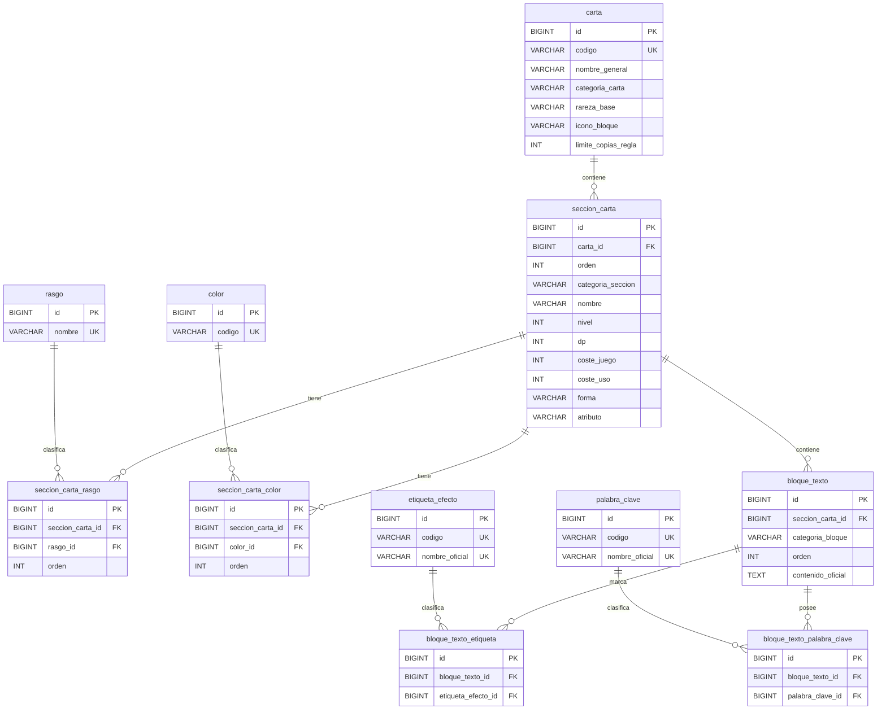

# Modelo de datos del backend

Este documento describe el modelo de datos implementado actualmente en el backend de `PaginaTCG`. La fuente de verdad son las migraciones Flyway existentes en `backend/src/main/resources/db/migration/` y las entidades Java del paquete `com.jotilla.paginatcg.entity`.

## Responsabilidad de Flyway y Hibernate

Flyway es el responsable de crear y evolucionar el esquema de MySQL. Hibernate está configurado con:

```properties
spring.jpa.hibernate.ddl-auto=validate
```

Esto significa que Hibernate valida que las entidades coincidan con el esquema, pero no crea, modifica ni elimina tablas. Las migraciones ya aplicadas son inmutables: no se editan para cambiar formato, comentarios, restricciones o sentencias, porque eso alteraría el checksum de Flyway.

El estado actual llega hasta `V7__crear_tablas_palabra_clave.sql`. El siguiente cambio de esquema deberá comenzar en `V8` o en la siguiente versión que corresponda según el estado real del repositorio. `V8` se contempla únicamente como siguiente paso previsto para los requisitos normales de evolución; no está implementada todavía.

## Migraciones

### V1__crear_tabla_carta.sql

Crea la tabla `carta`, que representa la identidad lógica de una carta.

Tablas creadas:

- `carta`

Columnas principales:

- `id`: clave primaria `BIGINT AUTO_INCREMENT`.
- `codigo`: número oficial visible de la carta, único.
- `nombre_general`: nombre general de la carta.
- `categoria_carta`: categoría principal almacenada como `VARCHAR`.
- `rareza_base`: rareza base, nullable.
- `icono_bloque`: icono de bloque, nullable.
- `limite_copias_regla`: límite propio de construcción, con valor por defecto `4`.

Restricciones:

- Primary key: `id`.
- Unique: `uk_carta_codigo` sobre `codigo`.
- Check: `chk_carta_limite_copias`, exige `limite_copias_regla >= 0`.

Claves foráneas y `ON DELETE`:

- No tiene claves foráneas.

Datos iniciales:

- No inserta datos.

Entidad Java relacionada:

- `Carta`

### V2__crear_tabla_seccion_carta.sql

Crea la tabla `seccion_carta`, que modela las secciones funcionales de una carta.

Tablas creadas:

- `seccion_carta`

Columnas principales:

- `id`: clave primaria `BIGINT AUTO_INCREMENT`.
- `carta_id`: referencia obligatoria a `carta`.
- `orden`: posición de la sección dentro de la carta, con valor por defecto `1`.
- `categoria_seccion`: categoría funcional de la sección, almacenada como `VARCHAR`.
- `nombre`: nombre de la sección.
- `nivel`, `dp`, `coste_juego`, `coste_uso`: valores numéricos nullable.
- `forma`, `atributo`: datos oficiales nullable.

Restricciones:

- Primary key: `id`.
- Unique: `uk_seccion_carta_carta_orden` sobre `(carta_id, orden)`.
- Checks: `orden > 0`; `nivel`, `dp`, `coste_juego` y `coste_uso` deben ser `NULL` o valores `>= 0`.

Claves foráneas y `ON DELETE`:

- `fk_seccion_carta_carta`: `carta_id` referencia `carta(id)` con `ON DELETE CASCADE`.

Datos iniciales:

- No inserta datos.

Entidades Java relacionadas:

- `SeccionCarta`
- `Carta`
- `CategoriaCarta`

### V3__crear_tablas_rasgo.sql

Crea el catálogo de rasgos y su relación con secciones de carta.

Tablas creadas:

- `rasgo`
- `seccion_carta_rasgo`

Propósito:

- `rasgo` almacena cada rasgo una sola vez.
- `seccion_carta_rasgo` permite que una sección tenga múltiples rasgos y conserva su orden oficial.

Restricciones:

- `rasgo`: primary key `id`; unique `uk_rasgo_nombre` sobre `nombre`.
- `seccion_carta_rasgo`: primary key `id`.
- Unique `uk_seccion_carta_rasgo_seccion_rasgo` sobre `(seccion_carta_id, rasgo_id)`.
- Unique `uk_seccion_carta_rasgo_seccion_orden` sobre `(seccion_carta_id, orden)`.
- Check `chk_seccion_carta_rasgo_orden`, exige `orden > 0`.

Claves foráneas y `ON DELETE`:

- `fk_seccion_carta_rasgo_seccion`: referencia `seccion_carta(id)` con `ON DELETE CASCADE`.
- `fk_seccion_carta_rasgo_rasgo`: referencia `rasgo(id)` con `ON DELETE RESTRICT`.

Datos iniciales:

- No inserta datos.

Entidades Java relacionadas:

- `Rasgo`
- `SeccionCartaRasgo`
- `SeccionCarta`

### V4__crear_tablas_color.sql

Crea el catálogo de colores y su relación con secciones de carta.

Tablas creadas:

- `color`
- `seccion_carta_color`

Propósito:

- `color` almacena códigos internos de color.
- `seccion_carta_color` permite que una sección tenga uno o varios colores y conserva su orden oficial.

Restricciones:

- `color`: primary key `id`; unique `uk_color_codigo` sobre `codigo`.
- `seccion_carta_color`: primary key `id`.
- Unique `uk_seccion_carta_color_seccion_color` sobre `(seccion_carta_id, color_id)`.
- Unique `uk_seccion_carta_color_seccion_orden` sobre `(seccion_carta_id, orden)`.
- Check `chk_seccion_carta_color_orden`, exige `orden > 0`.

Claves foráneas y `ON DELETE`:

- `fk_seccion_carta_color_seccion`: referencia `seccion_carta(id)` con `ON DELETE CASCADE`.
- `fk_seccion_carta_color_color`: referencia `color(id)` con `ON DELETE RESTRICT`.

Datos iniciales:

- Inserta `RED`, `BLUE`, `YELLOW`, `GREEN`, `BLACK`, `PURPLE` y `WHITE`.

Entidades Java relacionadas:

- `ColorCarta`
- `SeccionCartaColor`
- `SeccionCarta`

### V5__crear_tabla_bloque_texto.sql

Crea la tabla `bloque_texto`, que conserva cajas oficiales completas de texto.

Tablas creadas:

- `bloque_texto`

Columnas principales:

- `id`: clave primaria `BIGINT AUTO_INCREMENT`.
- `seccion_carta_id`: referencia obligatoria a `seccion_carta`.
- `categoria_bloque`: tipo de caja de texto, almacenado como `VARCHAR`.
- `orden`: posición del bloque dentro de la sección.
- `contenido_oficial`: texto oficial completo en inglés.

Restricciones e índices:

- Primary key: `id`.
- Unique `uk_bloque_texto_seccion_orden` sobre `(seccion_carta_id, orden)`.
- Check `chk_bloque_texto_orden`, exige `orden > 0`.
- Check `chk_bloque_texto_contenido`, exige contenido no vacío tras `TRIM`.
- Index `idx_bloque_texto_seccion_categoria` sobre `(seccion_carta_id, categoria_bloque)`.

Claves foráneas y `ON DELETE`:

- `fk_bloque_texto_seccion`: referencia `seccion_carta(id)` con `ON DELETE CASCADE`.

Datos iniciales:

- No inserta datos.

Entidades Java relacionadas:

- `BloqueTexto`
- `SeccionCarta`
- `CategoriaBloqueTexto`

### V6__crear_tablas_etiqueta_efecto.sql

Crea el catálogo extensible de etiquetas oficiales de activación o temporización y su relación con bloques de texto.

Tablas creadas:

- `etiqueta_efecto`
- `bloque_texto_etiqueta`

Propósito:

- `etiqueta_efecto` almacena etiquetas oficiales presentes en el texto, como `[Main]`, `[Delay]`, `[On Play]`, `[When Digivolving]` o `[When Attacking]`.
- `bloque_texto_etiqueta` indica que una etiqueta aparece al menos una vez en un bloque completo, sin dividir `contenido_oficial`.

Restricciones e índices:

- `etiqueta_efecto`: primary key `id`.
- Unique `uk_etiqueta_efecto_codigo` sobre `codigo`.
- Unique `uk_etiqueta_efecto_nombre` sobre `nombre_oficial`.
- Checks `chk_etiqueta_efecto_codigo` y `chk_etiqueta_efecto_nombre`, exigen texto no vacío.
- `bloque_texto_etiqueta`: primary key `id`.
- Unique `uk_bloque_texto_etiqueta` sobre `(bloque_texto_id, etiqueta_efecto_id)`.
- Index `idx_bloque_texto_etiqueta_etiqueta` sobre `(etiqueta_efecto_id, bloque_texto_id)`.

Claves foráneas y `ON DELETE`:

- `fk_bloque_texto_etiqueta_bloque`: referencia `bloque_texto(id)` con `ON DELETE CASCADE`.
- `fk_bloque_texto_etiqueta_etiqueta`: referencia `etiqueta_efecto(id)` con `ON DELETE RESTRICT`.

Datos iniciales:

- No inserta datos. El catálogo inicial de etiquetas sigue pendiente.

Entidades Java relacionadas:

- `EtiquetaEfecto`
- `BloqueTextoEtiqueta`
- `BloqueTexto`

### V7__crear_tablas_palabra_clave.sql

Crea el catálogo extensible de palabras clave y su relación con bloques de texto.

Tablas creadas:

- `palabra_clave`
- `bloque_texto_palabra_clave`

Propósito:

- `palabra_clave` almacena mecánicas oficiales como palabras clave.
- `bloque_texto_palabra_clave` indica que una palabra clave propia aparece directamente en un bloque completo de una sección.

Restricciones e índices:

- `palabra_clave`: primary key `id`.
- Unique `uk_palabra_clave_codigo` sobre `codigo`.
- Unique `uk_palabra_clave_nombre` sobre `nombre_oficial`.
- Checks `chk_palabra_clave_codigo` y `chk_palabra_clave_nombre`, exigen texto no vacío.
- `bloque_texto_palabra_clave`: primary key `id`.
- Unique `uk_bloque_texto_palabra_clave` sobre `(bloque_texto_id, palabra_clave_id)`.
- Index `idx_bloque_palabra_clave_palabra` sobre `(palabra_clave_id, bloque_texto_id)`.

Claves foráneas y `ON DELETE`:

- `fk_bloque_palabra_clave_bloque`: referencia `bloque_texto(id)` con `ON DELETE CASCADE`.
- `fk_bloque_palabra_clave_palabra`: referencia `palabra_clave(id)` con `ON DELETE RESTRICT`.

Datos iniciales:

- No inserta datos. El catálogo inicial de palabras clave sigue pendiente.

Entidades Java relacionadas:

- `PalabraClave`
- `BloqueTextoPalabraClave`
- `BloqueTexto`

## Decisiones del dominio

`Carta` representa la identidad lógica común de una carta: código oficial, nombre general, categoría, rareza base, icono de bloque y límite de copias. `SeccionCarta` representa cada parte funcional de esa carta. Una carta normal suele tener una sección; una carta `DUAL` puede tener varias secciones, cada una con su categoría concreta.

Como cada `BloqueTexto` pertenece a una `SeccionCarta`, los datos asociados a un bloque no deben atribuirse indiscriminadamente a todas las secciones de la carta.

La ausencia real de datos como nivel, DP o costes se representa con `NULL`. No se usan valores artificiales como `0`, `-1` o `"-"` para expresar que el dato no existe. Existen Digimon sin nivel, por lo que `nivel` debe poder ser `NULL`.

Forma, atributo y rasgos son conceptos separados. Por ejemplo, una sección puede tener forma `Mega`, atributo `Vaccine` y rasgos como `Holy Warrior` y `Royal Knight`. Los rasgos no se guardan como texto separado por comas ni como columnas numeradas.

Rasgos y colores son catálogos reutilizables. Las tablas relacionales `seccion_carta_rasgo` y `seccion_carta_color` permiten filtrar por múltiples valores y conservar el orden oficial.

Cada `BloqueTexto` conserva una caja oficial completa en inglés. El texto no se divide inicialmente en cada efecto individual, porque `contenido_oficial` debe seguir siendo la fuente de verdad.

Las etiquetas de efecto indican presencia dentro de un bloque completo, sin dividir `contenido_oficial`. Son etiquetas oficiales de activación o temporización como `[Main]`, `[Delay]`, `[On Play]`, `[When Digivolving]` o `[When Attacking]`. El catálogo `etiqueta_efecto` sigue vacío en las migraciones actuales.

Las palabras clave son mecánicas como `<Blocker>`, `<Rush>` o `<Jamming>`. La relación `bloque_texto_palabra_clave` representa solamente palabras clave propias presentadas directamente en un bloque de una sección. No representa una propiedad global de toda `Carta`, porque una carta `DUAL` puede tener secciones diferentes. El catálogo `palabra_clave` también sigue vacío en las migraciones actuales.

`limite_copias_regla` representa el límite propio de construcción asociado a la carta. El valor habitual por defecto es `4`. No almacena automáticamente restricciones externas, baneos o pares prohibidos; esas restricciones se modelarán posteriormente.

Los enums se reservan para conjuntos cerrados y controlados, como `CategoriaCarta` y `CategoriaBloqueTexto`. Los catálogos extensibles, como etiquetas de efecto y palabras clave, se almacenan en tablas.

### Criterios de interpretación del texto oficial

`contenido_oficial` es la fuente de verdad para el texto completo de cada caja oficial. El modelo estructura solo dos tipos de presencia textual en esta fase:

- Etiquetas oficiales de activación o temporización presentes en el bloque.
- Palabras clave directamente poseídas por la sección en ese bloque.

No se crean etiquetas semánticas inferidas para reducciones de coste, acciones gratuitas, evoluciones gratuitas o requisitos ignorados. Ejemplos de ideas que no se modelan como etiquetas actuales son `PLAY_COST_REDUCTION`, `DIGIVOLUTION_COST_REDUCTION`, `PLAY_WITHOUT_PAYING_COST`, `DIGIVOLVE_WITHOUT_PAYING_COST` o `IGNORE_DIGIVOLUTION_REQUIREMENTS`.

Las menciones, concesiones, eliminaciones, negaciones o usos condicionales de palabras clave se consultan mediante búsqueda textual en `contenido_oficial`. Esto incluye casos donde una frase concede una palabra clave a la propia sección: al ser una concesión mediante otro efecto, no genera una fila en `bloque_texto_palabra_clave`.

Las evoluciones normales estructuradas están previstas para una migración futura. Las evoluciones especiales y sus condiciones se conservarán completas dentro del texto oficial y podrán localizarse mediante búsqueda textual o patrones oficiales exactos, sin crear clasificaciones semánticas excesivas.

Un valor de color ausente en Heroicc no debe interpretarse como "cualquier color". "Cualquier color" deberá estar representado explícitamente por los colores admitidos. La validación y corrección de omisiones conocidas en requisitos estructurados, como el color amarillo de la evolución normal de `BT23-034` Sakuyamon y `BT23-028` Coordemon, corresponderá al futuro importador, no a las entidades actuales.

## Ejemplos

Carta con varios colores:

- Una sección multicolor se guarda con una fila en `seccion_carta` y varias filas en `seccion_carta_color`.
- Si una carta tiene colores `RED` y `BLUE`, ambos apuntan al catálogo `color` y el campo `orden` conserva la secuencia oficial.

Sección con varios rasgos:

- Omnimon podría tener `forma = "Mega"`, `atributo = "Vaccine"` y rasgos `Holy Warrior` y `Royal Knight`.
- Los rasgos se guardan como filas reutilizables en `rasgo` y se relacionan con la sección mediante `seccion_carta_rasgo`.

Bloque con varias etiquetas:

- Un bloque `EFFECT` puede contener texto con `[Main]` y `[Delay]`.
- Se conserva una sola fila en `bloque_texto` con el texto completo.
- Se crean relaciones en `bloque_texto_etiqueta` para las etiquetas presentes.

Bloque con varias palabras clave propias:

- Si un bloque presenta directamente `<Blocker>` y `<Reboot>` como palabras clave propias de la sección, se conserva el texto completo en `bloque_texto`.
- Cada palabra clave propia se relaciona mediante `bloque_texto_palabra_clave`.
- La relación no cuenta apariciones ni divide el bloque en efectos individuales.

Diferencia entre poseer y mencionar `<Blocker>`:

- Si la sección tiene directamente `<Blocker>`, el bloque se relaciona con la palabra clave `Blocker`.
- Si el texto dice que otro Digimon gana `<Blocker>`, no se crea la relación directa; se encontrará buscando `<Blocker>` en `contenido_oficial`.
- Si el texto concede `<Blocker>` mediante otra frase, incluso a la propia sección, tampoco se crea la relación directa; se localizará mediante búsqueda textual.

## Diagrama


