# Modelo de datos del backend

Este documento describe el modelo de datos implementado actualmente en el backend de `PaginaTCG`. La fuente de verdad son las migraciones Flyway existentes en `backend/src/main/resources/db/migration/` y las entidades Java del paquete `com.jotilla.paginatcg.entity`.

## Responsabilidad de Flyway y Hibernate

Flyway es el responsable de crear y evolucionar el esquema de MySQL. Hibernate está configurado con:

```properties
spring.jpa.hibernate.ddl-auto=validate
```

Esto significa que Hibernate valida que las entidades coincidan con el esquema, pero no crea, modifica ni elimina tablas. Las migraciones ya aplicadas son inmutables: no se editan para cambiar formato, comentarios, restricciones o sentencias, porque eso alteraría el checksum de Flyway.

El estado actual llega hasta `V12__crear_erratas.sql`. Las migraciones V1 a V12 están implementadas, aplicadas y validadas y no deben modificarse. El siguiente cambio de esquema deberá comenzar en `V13` o en la siguiente versión que corresponda según el estado real del repositorio.

## Migraciones

### V1__crear_tabla_carta.sql

Crea la tabla `carta`, que representa la identidad lógica de una carta.

Tablas creadas:

- `carta`

Columnas principales:

- `id`: clave primaria `BIGINT AUTO_INCREMENT`.
- `codigo`: número oficial visible de la carta, único.
- `nombre_general`: nombre general de la carta.
- `categoria_carta`: categoría principal almacenada como `VARCHAR`.
- `rareza_base`: rareza base, nullable.
- `icono_bloque`: icono de bloque, nullable.
- `limite_copias_regla`: límite propio de construcción, con valor por defecto `4`.

Restricciones:

- Primary key: `id`.
- Unique: `uk_carta_codigo` sobre `codigo`.
- Check: `chk_carta_limite_copias`, exige `limite_copias_regla >= 0`.

Claves foráneas y `ON DELETE`:

- No tiene claves foráneas.

Datos iniciales:

- No inserta datos.

Entidad Java relacionada:

- `Carta`

### V2__crear_tabla_seccion_carta.sql

Crea la tabla `seccion_carta`, que modela las secciones funcionales de una carta.

Tablas creadas:

- `seccion_carta`

Columnas principales:

- `id`: clave primaria `BIGINT AUTO_INCREMENT`.
- `carta_id`: referencia obligatoria a `carta`.
- `orden`: posición de la sección dentro de la carta, con valor por defecto `1`.
- `categoria_seccion`: categoría funcional de la sección, almacenada como `VARCHAR`.
- `nombre`: nombre de la sección.
- `nivel`, `dp`, `coste_juego`, `coste_uso`: valores numéricos nullable.
- `atributo`: dato oficial nullable.
- `forma`: columna textual creada originalmente por V2, migrada al catálogo `forma_carta` y eliminada por V8.

Restricciones:

- Primary key: `id`.
- Unique: `uk_seccion_carta_carta_orden` sobre `(carta_id, orden)`.
- Checks: `orden > 0`; `nivel`, `dp`, `coste_juego` y `coste_uso` deben ser `NULL` o valores `>= 0`.

Claves foráneas y `ON DELETE`:

- `fk_seccion_carta_carta`: `carta_id` referencia `carta(id)` con `ON DELETE CASCADE`.

Datos iniciales:

- No inserta datos.

Entidades Java relacionadas:

- `SeccionCarta`
- `Carta`
- `CategoriaCarta`

### V3__crear_tablas_rasgo.sql

Crea el catálogo de rasgos y su relación con secciones de carta.

Tablas creadas:

- `rasgo`
- `seccion_carta_rasgo`

Propósito:

- `rasgo` almacena cada rasgo una sola vez.
- `seccion_carta_rasgo` permite que una sección tenga múltiples rasgos y conserva su orden oficial.

Restricciones:

- `rasgo`: primary key `id`; unique `uk_rasgo_nombre` sobre `nombre`.
- `seccion_carta_rasgo`: primary key `id`.
- Unique `uk_seccion_carta_rasgo_seccion_rasgo` sobre `(seccion_carta_id, rasgo_id)`.
- Unique `uk_seccion_carta_rasgo_seccion_orden` sobre `(seccion_carta_id, orden)`.
- Check `chk_seccion_carta_rasgo_orden`, exige `orden > 0`.

Claves foráneas y `ON DELETE`:

- `fk_seccion_carta_rasgo_seccion`: referencia `seccion_carta(id)` con `ON DELETE CASCADE`.
- `fk_seccion_carta_rasgo_rasgo`: referencia `rasgo(id)` con `ON DELETE RESTRICT`.

Datos iniciales:

- No inserta datos.

Entidades Java relacionadas:

- `Rasgo`
- `SeccionCartaRasgo`
- `SeccionCarta`

### V4__crear_tablas_color.sql

Crea el catálogo de colores y su relación con secciones de carta.

Tablas creadas:

- `color`
- `seccion_carta_color`

Propósito:

- `color` almacena códigos internos de color.
- `seccion_carta_color` permite que una sección tenga uno o varios colores y conserva su orden oficial.

Restricciones:

- `color`: primary key `id`; unique `uk_color_codigo` sobre `codigo`.
- `seccion_carta_color`: primary key `id`.
- Unique `uk_seccion_carta_color_seccion_color` sobre `(seccion_carta_id, color_id)`.
- Unique `uk_seccion_carta_color_seccion_orden` sobre `(seccion_carta_id, orden)`.
- Check `chk_seccion_carta_color_orden`, exige `orden > 0`.

Claves foráneas y `ON DELETE`:

- `fk_seccion_carta_color_seccion`: referencia `seccion_carta(id)` con `ON DELETE CASCADE`.
- `fk_seccion_carta_color_color`: referencia `color(id)` con `ON DELETE RESTRICT`.

Datos iniciales:

- Inserta `RED`, `BLUE`, `YELLOW`, `GREEN`, `BLACK`, `PURPLE` y `WHITE`.

Entidades Java relacionadas:

- `ColorCarta`
- `SeccionCartaColor`
- `SeccionCarta`

### V5__crear_tabla_bloque_texto.sql

Crea la tabla `bloque_texto`, que conserva cajas oficiales completas de texto.

Tablas creadas:

- `bloque_texto`

Columnas principales:

- `id`: clave primaria `BIGINT AUTO_INCREMENT`.
- `seccion_carta_id`: referencia obligatoria a `seccion_carta`.
- `categoria_bloque`: tipo de caja de texto, almacenado como `VARCHAR`.
- `orden`: posición del bloque dentro de la sección.
- `contenido_oficial`: texto oficial completo en inglés.

Restricciones e índices:

- Primary key: `id`.
- Unique `uk_bloque_texto_seccion_orden` sobre `(seccion_carta_id, orden)`.
- Check `chk_bloque_texto_orden`, exige `orden > 0`.
- Check `chk_bloque_texto_contenido`, exige contenido no vacío tras `TRIM`.
- Index `idx_bloque_texto_seccion_categoria` sobre `(seccion_carta_id, categoria_bloque)`.

Claves foráneas y `ON DELETE`:

- `fk_bloque_texto_seccion`: referencia `seccion_carta(id)` con `ON DELETE CASCADE`.

Datos iniciales:

- No inserta datos.

Entidades Java relacionadas:

- `BloqueTexto`
- `SeccionCarta`
- `CategoriaBloqueTexto`

### V6__crear_tablas_etiqueta_efecto.sql

Crea el catálogo extensible de etiquetas oficiales de activación o temporización y su relación con bloques de texto.

Tablas creadas:

- `etiqueta_efecto`
- `bloque_texto_etiqueta`

Propósito:

- `etiqueta_efecto` almacena etiquetas oficiales presentes en el texto, como `[Main]`, `[Delay]`, `[On Play]`, `[When Digivolving]` o `[When Attacking]`.
- `bloque_texto_etiqueta` indica que una etiqueta aparece al menos una vez en un bloque completo, sin dividir `contenido_oficial`.

Restricciones e índices:

- `etiqueta_efecto`: primary key `id`.
- Unique `uk_etiqueta_efecto_codigo` sobre `codigo`.
- Unique `uk_etiqueta_efecto_nombre` sobre `nombre_oficial`.
- Checks `chk_etiqueta_efecto_codigo` y `chk_etiqueta_efecto_nombre`, exigen texto no vacío.
- `bloque_texto_etiqueta`: primary key `id`.
- Unique `uk_bloque_texto_etiqueta` sobre `(bloque_texto_id, etiqueta_efecto_id)`.
- Index `idx_bloque_texto_etiqueta_etiqueta` sobre `(etiqueta_efecto_id, bloque_texto_id)`.

Claves foráneas y `ON DELETE`:

- `fk_bloque_texto_etiqueta_bloque`: referencia `bloque_texto(id)` con `ON DELETE CASCADE`.
- `fk_bloque_texto_etiqueta_etiqueta`: referencia `etiqueta_efecto(id)` con `ON DELETE RESTRICT`.

Datos iniciales:

- No inserta datos. El catálogo inicial de etiquetas sigue pendiente.

Entidades Java relacionadas:

- `EtiquetaEfecto`
- `BloqueTextoEtiqueta`
- `BloqueTexto`

### V7__crear_tablas_palabra_clave.sql

Crea el catálogo extensible de palabras clave y su relación con bloques de texto.

Tablas creadas:

- `palabra_clave`
- `bloque_texto_palabra_clave`

Propósito:

- `palabra_clave` almacena mecánicas oficiales como palabras clave.
- `bloque_texto_palabra_clave` indica que una palabra clave propia aparece directamente en un bloque completo de una sección.

Restricciones e índices:

- `palabra_clave`: primary key `id`.
- Unique `uk_palabra_clave_codigo` sobre `codigo`.
- Unique `uk_palabra_clave_nombre` sobre `nombre_oficial`.
- Checks `chk_palabra_clave_codigo` y `chk_palabra_clave_nombre`, exigen texto no vacío.
- `bloque_texto_palabra_clave`: primary key `id`.
- Unique `uk_bloque_texto_palabra_clave` sobre `(bloque_texto_id, palabra_clave_id)`.
- Index `idx_bloque_palabra_clave_palabra` sobre `(palabra_clave_id, bloque_texto_id)`.

Claves foráneas y `ON DELETE`:

- `fk_bloque_palabra_clave_bloque`: referencia `bloque_texto(id)` con `ON DELETE CASCADE`.
- `fk_bloque_palabra_clave_palabra`: referencia `palabra_clave(id)` con `ON DELETE RESTRICT`.

Datos iniciales:

- No inserta datos. El catálogo inicial de palabras clave sigue pendiente.

Entidades Java relacionadas:

- `PalabraClave`
- `BloqueTextoPalabraClave`
- `BloqueTexto`

### V8__crear_formas_y_requisitos_evolucion_normal.sql

Crea el catálogo de formas y la estructura de los requisitos normales de evolución.

Tablas creadas:

- `forma_carta`
- `requisito_evolucion_normal`
- `requisito_evolucion_normal_color`

Cambios en `seccion_carta`:

- Añade `forma_carta_id` nullable como relación con `forma_carta`.
- Migra las formas textuales existentes comparando su valor con `nombre_oficial`.
- Comprueba que toda forma textual no vacía haya podido migrarse.
- Elimina la columna textual `forma` después de la comprobación.

Catálogo `forma_carta`:

- Sus campos son `id`, `codigo` y `nombre_oficial`.
- Es un catálogo extensible, no un enum.
- Se reutiliza tanto para la forma propia de una sección como para la forma de origen exigida por un requisito. Estas relaciones son independientes.
- V8 inserta `IN_TRAINING`, `ROOKIE`, `CHAMPION`, `ULTIMATE`, `MEGA`, `ARMOR_FORM`, `HYBRID`, `D_REAPER`, `EATER`, `UNKNOWN`, `APPMON`, `STANDARD_APPMON`, `SUPER_APPMON`, `ULTIMATE_APPMON`, `GOD_APPMON` y `UNKNOWN_APPMON`.

Requisitos normales:

- Cada fila de `requisito_evolucion_normal` pertenece a una `SeccionCarta` y representa una alternativa oficial completa.
- Los campos presentes en una misma fila forman conjuntamente una condición.
- `orden` conserva la posición visual oficial de la alternativa dentro de la sección.
- `categoria_origen` es nullable y solo se rellena si Bandai exige explícitamente una categoría, como `TAMER`. No se deduce `DIGIMON` o `DIGI_EGG` a partir de `nivel_origen`.
- `nivel_origen` y `forma_origen_id` son nullable. `forma_origen_id` conserva exactamente la forma exigida por el requisito.
- `coste` es obligatorio, debe ser mayor o igual que cero y admite el valor `0`.
- Los colores concretos admitidos se relacionan mediante `requisito_evolucion_normal_color`, cuyo `orden` conserva su posición oficial.
- `cualquier_color = true` significa que el requisito admite cualquier color y no tendrá relaciones con colores concretos.
- `cualquier_color = false` sin filas en `requisito_evolucion_normal_color` significa que el requisito no exige color.
- Los colores del requisito son independientes de los colores propios de la sección almacenados en `seccion_carta_color`.

Restricciones y claves foráneas principales:

- Unique `uk_requisito_evolucion_normal_seccion_orden` sobre `(seccion_carta_id, orden)`.
- Checks para exigir `orden > 0`, `nivel_origen` nulo o positivo y `coste >= 0`.
- `seccion_carta_id` referencia `seccion_carta(id)` con `ON DELETE CASCADE`.
- `forma_origen_id` y `seccion_carta.forma_carta_id` referencian `forma_carta(id)` con `ON DELETE RESTRICT`.
- En `requisito_evolucion_normal_color` no pueden repetirse un color ni una posición dentro del mismo requisito.
- Sus claves foráneas usan `ON DELETE CASCADE` hacia el requisito y `ON DELETE RESTRICT` hacia `color`.

Entidades Java relacionadas:

- `FormaCarta`
- `SeccionCarta`
- `RequisitoEvolucionNormal`
- `RequisitoEvolucionNormalColor`
- `ColorCarta`

### V9__crear_impresiones_y_lanzamientos.sql

Separa la identidad funcional de una carta de sus variantes físicas o gráficas y de los productos en los que se publican.

Tablas creadas:

- `idioma`
- `lanzamiento`
- `impresion_carta`
- `impresion_carta_lanzamiento`
- `ilustrador`
- `impresion_carta_ilustrador`

Catálogo `idioma`:

- Es un catálogo extensible con `id`, `codigo` y `nombre`, no un enum.
- V9 inserta `EN`, `JA`, `KO` y `ZH_HANS`.
- El idioma pertenece a impresiones y lanzamientos; no duplica el contenido funcional de `Carta`.

Impresiones:

- `Carta` conserva la identidad funcional única por código oficial.
- Cada fila de `impresion_carta` representa una variante física o gráfica de una `Carta` en un idioma.
- `numero_variante = 0` identifica la impresión base dentro de ese idioma.
- Los valores de `numero_variante` superiores a cero diferencian artes alternativas o reimpresiones.
- La restricción `uk_impresion_carta_carta_idioma_variante` hace única la combinación `(carta_id, idioma_id, numero_variante)`.
- `url_imagen`, `notas`, `estrellas` y `sello` son datos opcionales propios de la impresión.
- El frontend podrá consultar solo la impresión base o mostrar todas las variantes disponibles.
- Una futura colección o mazo podrá referenciar la `ImpresionCarta` concreta que posee o utiliza el usuario.

Lanzamientos:

- `lanzamiento` representa un producto, promoción, torneo u otra publicación dentro de un idioma.
- Su código es único dentro de cada idioma y `fecha` es nullable porque algunos grupos de promociones o eventos no tienen una única fecha conocida.
- Puede conservar URLs del producto, lista de cartas, imagen y miniatura cuando estén disponibles.
- `impresion_carta_lanzamiento` permite que una misma impresión esté relacionada con varios lanzamientos sin duplicar la impresión.

Ilustradores:

- `ilustrador` es un catálogo reutilizable por `nombre_credito`.
- Una impresión puede no tener ilustradores registrados o relacionarse con uno o varios.
- `impresion_carta_ilustrador.orden` conserva la posición oficial de cada nombre dentro del crédito.
- No pueden repetirse el mismo ilustrador ni la misma posición dentro de una impresión.

Claves foráneas y `ON DELETE` principales:

- `lanzamiento.idioma_id` e `impresion_carta.idioma_id` referencian `idioma(id)` con `ON DELETE RESTRICT`.
- `impresion_carta.carta_id` referencia `carta(id)` con `ON DELETE CASCADE`.
- Las tablas relacionales eliminan sus filas con `ON DELETE CASCADE` cuando se elimina la impresión.
- Las referencias desde las tablas relacionales hacia `lanzamiento` e `ilustrador` usan `ON DELETE RESTRICT`.

Entidades Java relacionadas:

- `Idioma`
- `Lanzamiento`
- `ImpresionCarta`
- `ImpresionCartaLanzamiento`
- `Ilustrador`
- `ImpresionCartaIlustrador`

### V10__crear_informacion_link.sql

Estructura la información propia de la mecánica Link y sus requisitos sin trasladar a estas tablas los efectos funcionales de la carta.

Tablas creadas:

- `informacion_link`
- `requisito_link`
- `requisito_link_rasgo`

Información estructural Link:

- Cada fila de `informacion_link` pertenece obligatoriamente a una `SeccionCarta`.
- La restricción unique sobre `seccion_carta_id` permite como máximo una `InformacionLink` por sección.
- `bonificacion_dp` almacena la bonificación numérica de DP y debe ser mayor o igual que cero.
- `contenido_dp_oficial` conserva la representación oficial completa del valor de Link DP definida por la carta.
- `InformacionLink` no representa todo el bloque visual Link ni almacena sus efectos.
- No existe una foreign key ni una relación JPA directa entre `informacion_link` y `bloque_texto`.

Requisitos Link:

- Una `InformacionLink` puede tener varios `RequisitoLink`.
- Cada fila de `requisito_link` representa una alternativa oficial completa para realizar Link.
- `orden` conserva la posición visual de la alternativa, `coste` almacena su coste y `contenido_oficial` mantiene el texto íntegro del requisito.
- La combinación `(informacion_link_id, orden)` es única.
- `requisito_link_rasgo` permite relacionar uno o varios rasgos admitidos por un requisito.
- Sus relaciones con `Rasgo` representan condiciones del requisito, no rasgos propios de la `SeccionCarta`.
- `orden` conserva la posición oficial de los rasgos y no pueden repetirse un rasgo ni una posición dentro del mismo requisito.

Efectos Link:

- Los efectos que aparecen visualmente en la zona Link continúan en el sistema general de `BloqueTexto`.
- Cuando una caja corresponde a un efecto Link, utiliza `CategoriaBloqueTexto.LINK_EFFECT`.
- Esta separación mantiene independientes la estructura de la mecánica, los requisitos para utilizarla y los efectos funcionales escritos de la carta.

Relaciones y borrado:

- Las relaciones Java usan `FetchType.LAZY` y no incorporan cascadas JPA, `orphanRemoval` ni relaciones bidireccionales innecesarias.
- `informacion_link.seccion_carta_id`, `requisito_link.informacion_link_id` y `requisito_link_rasgo.requisito_link_id` usan `ON DELETE CASCADE`.
- `requisito_link_rasgo.rasgo_id` usa `ON DELETE RESTRICT`.
- Flyway y MySQL, no las cascadas JPA, mantienen estos comportamientos de borrado.

Entidades Java relacionadas:

- `InformacionLink`
- `RequisitoLink`
- `RequisitoLinkRasgo`
- `SeccionCarta`
- `Rasgo`
- `BloqueTexto`
- `CategoriaBloqueTexto`

### V11__crear_restricciones_competitivas.sql

Estructura las restricciones competitivas individuales aplicadas a códigos de carta y los pares de cartas que no pueden utilizarse simultáneamente.

Tablas creadas:

- `tipo_restriccion_competitiva`
- `restriccion_competitiva_carta`
- `restriccion_pareja`

Catálogo de tipos:

- `TipoRestriccionCompetitiva` es un catálogo extensible y no un enum.
- V11 carga inicialmente `BAN` y `RESTRICT`.
- Estos códigos conservan la clase oficial de decisión, pero no se consideran una lista cerrada: Bandai podría introducir otros tipos en el futuro.

Restricciones individuales:

- Cada `RestriccionCompetitivaCarta` pertenece a una `Carta`, no a una `ImpresionCarta`, porque afecta al código funcional y a todas sus impresiones.
- `tipo_restriccion_competitiva_id` identifica la clase oficial de restricción y `maximo_copias` conserva su consecuencia cuantitativa; son conceptos relacionados, pero no equivalentes.
- `maximo_copias` es obligatorio. Un baneo se representa con `BAN` y valor `0`; una restricción conserva el máximo real permitido, normalmente `1` en los casos actuales, aunque el modelo admite otros valores.
- `fecha_inicio` es el primer día en que la restricción está vigente y es obligatoria.
- `fecha_fin` es el primer día en que deja de estar vigente; permanece `NULL` mientras continúe activa.
- `nota` permite conservar información adicional y es opcional.
- No se almacena la fecha de anuncio ni existe actualmente un tipo `UNRESTRICT`. La retirada se registra cerrando el periodo mediante `fecha_fin`.
- La restricción `(carta_id, fecha_inicio)` evita duplicar el mismo inicio y permite conservar otros periodos históricos de la misma carta.
- Cuando existe, `fecha_fin` debe ser posterior a `fecha_inicio`.

Pares prohibidos:

- `RestriccionPareja` representa exclusivamente dos códigos que no pueden utilizarse simultáneamente en un mazo; no reduce por sí misma el límite individual de ninguna carta.
- `carta_a_id` y `carta_b_id` relacionan directamente dos filas de `Carta`.
- `carta_a_id < carta_b_id` impide relacionar una carta consigo misma y establece una representación canónica que evita duplicar A-B como B-A.
- La combinación `(carta_a_id, carta_b_id, fecha_inicio)` evita repetir el mismo inicio de periodo y permite que el mismo par vuelva a estar prohibido en otro periodo.
- Sus fechas siguen la misma semántica de inicio inclusivo y fin exclusivo que las restricciones individuales.

Validación y persistencia:

- La coherencia semántica entre tipo y máximo, como `BAN` con `0` o `RESTRICT` con un valor mayor que cero, se validará en el futuro importador o capa de escritura.
- Los posibles solapamientos entre periodos históricos también se validarán fuera del esquema. V11 no introduce triggers SQL para estas reglas.
- Las relaciones Java usan `FetchType.LAZY` y no incorporan cascadas JPA, `orphanRemoval` ni relaciones bidireccionales innecesarias.
- Las foreign keys hacia `Carta` usan `ON DELETE CASCADE`; la relación con `tipo_restriccion_competitiva` usa `ON DELETE RESTRICT`. Flyway y MySQL mantienen estos comportamientos.

Entidades Java relacionadas:

- `TipoRestriccionCompetitiva`
- `RestriccionCompetitivaCarta`
- `RestriccionPareja`
- `Carta`

### V12__crear_erratas.sql

Separa el historial oficial de correcciones de una carta funcional de las impresiones físicas concretas que contienen el texto erróneo.

Tablas creadas:

- `errata_carta`
- `errata_impresion_carta`

Errata oficial de la carta:

- Cada `ErrataCarta` pertenece obligatoriamente a una `Carta` y representa una corrección oficial o histórica de su contenido funcional.
- `seccion_carta_id` y `bloque_texto_id` son opcionales. Permiten localizar la parte afectada cuando la fuente aporta esa precisión, pero permanecen `NULL` cuando no puede determinarse sin inventar datos.
- `fecha` y `orden` identifican y ordenan las erratas de una carta; la combinación `(carta_id, fecha, orden)` es única.
- `ubicacion` describe opcionalmente la parte corregida.
- `texto_error` conserva el texto incorrecto y `texto_correccion` el texto oficial corregido; ambos son obligatorios y no pueden quedar vacíos.
- `notas` y `url_fuente` permiten conservar contexto y procedencia cuando estén disponibles.
- Al eliminar una `Carta`, sus erratas se eliminan con `ON DELETE CASCADE`. Si desaparecen la sección o el bloque referenciados, sus foreign keys pasan a `NULL` para conservar el historial de la corrección.

Impresiones físicas afectadas:

- `ErrataImpresionCarta` relaciona una `ErrataCarta` con cada `ImpresionCarta` que contiene físicamente el error.
- La combinación `(errata_carta_id, impresion_carta_id)` es única y puede incluir una nota específica de la impresión.
- Una reimpresión corregida sigue perteneciendo a la misma `Carta` y conserva su historial de errata, pero no crea una fila en `errata_impresion_carta`.
- Las dos foreign keys usan `ON DELETE CASCADE` para eliminar relaciones huérfanas.

Texto funcional y fuentes externas:

- El texto funcional canónico mostrado por la aplicación y utilizado para búsquedas debe ser el texto oficial corregido. La errata explica por qué ese contenido puede no coincidir con la imagen de una impresión antigua.
- Heroicc parece propagar una errata a todas las variantes del mismo número funcional, incluidas posibles reimpresiones posteriores. La futura importación no debe interpretar automáticamente esa propagación como prueba de que todas las impresiones contienen físicamente el error.
- El historial oficial se importará en `errata_carta`; las relaciones de `errata_impresion_carta` requerirán evidencia suficiente sobre cada variante física.

Entidades Java relacionadas:

- `ErrataCarta`
- `ErrataImpresionCarta`
- `Carta`
- `SeccionCarta`
- `BloqueTexto`
- `ImpresionCarta`

## Decisiones del dominio

`Carta` representa la identidad funcional única de una carta por código oficial: nombre general, categoría, rareza base, icono de bloque y límite de copias. `SeccionCarta` representa cada parte funcional de esa carta. Una carta normal suele tener una sección; una carta `DUAL` puede tener varias secciones, cada una con su categoría concreta.

Como cada `BloqueTexto` pertenece a una `SeccionCarta`, los datos asociados a un bloque no deben atribuirse indiscriminadamente a todas las secciones de la carta.

La ausencia real de datos como nivel, DP o costes se representa con `NULL`. No se usan valores artificiales como `0`, `-1` o `"-"` para expresar que el dato no existe. Existen Digimon sin nivel, por lo que `nivel` debe poder ser `NULL`.

Forma, atributo y rasgos son conceptos separados. Por ejemplo, una sección puede relacionarse con la forma `MEGA`, tener atributo `Vaccine` y rasgos como `Holy Warrior` y `Royal Knight`. Los rasgos no se guardan como texto separado por comas ni como columnas numeradas.

`forma_carta` es un catálogo extensible con `id`, `codigo` y `nombre_oficial`. `SeccionCarta.formaCarta` representa la forma propia de la sección, mientras que `RequisitoEvolucionNormal.formaOrigen` representa la forma exigida al origen de la evolución. Ambas relaciones reutilizan el catálogo, pero expresan datos diferentes.

Rasgos y colores son catálogos reutilizables. Las tablas relacionales `seccion_carta_rasgo` y `seccion_carta_color` permiten filtrar por múltiples valores y conservar el orden oficial.

Cada `BloqueTexto` conserva una caja oficial completa en inglés. El texto no se divide inicialmente en cada efecto individual, porque `contenido_oficial` debe seguir siendo la fuente de verdad.

Las etiquetas de efecto indican presencia dentro de un bloque completo, sin dividir `contenido_oficial`. Son etiquetas oficiales de activación o temporización como `[Main]`, `[Delay]`, `[On Play]`, `[When Digivolving]` o `[When Attacking]`. El catálogo `etiqueta_efecto` sigue vacío en las migraciones actuales.

Las palabras clave son mecánicas como `<Blocker>`, `<Rush>` o `<Jamming>`. La relación `bloque_texto_palabra_clave` representa solamente palabras clave propias presentadas directamente en un bloque de una sección. No representa una propiedad global de toda `Carta`, porque una carta `DUAL` puede tener secciones diferentes. El catálogo `palabra_clave` también sigue vacío en las migraciones actuales.

`limite_copias_regla` representa el límite propio de construcción asociado a la carta. El valor habitual por defecto es `4`, aunque una regla intrínseca puede permitir otra cantidad. No almacena restricciones competitivas externas: desde V11, estas se modelan mediante `RestriccionCompetitivaCarta` y `RestriccionPareja`.

Los enums se reservan para conjuntos cerrados y controlados, como `CategoriaCarta` y `CategoriaBloqueTexto`. Los catálogos extensibles, como formas, etiquetas de efecto y palabras clave, se almacenan en tablas.

Cada fila de `requisito_evolucion_normal` es una alternativa oficial completa. `categoria_origen`, `nivel_origen`, `forma_origen_id`, los colores relacionados y `coste` forman conjuntamente su condición; no son alternativas independientes entre sí. `categoria_origen` solo se utiliza cuando la categoría aparece de forma explícita y no se infiere a partir del nivel.

El modelo diferencia los colores propios de una sección, almacenados mediante `seccion_carta_color`, de los colores admitidos por un requisito, almacenados mediante `requisito_evolucion_normal_color`. `cualquier_color = true` representa de forma explícita que cualquier color es válido. Con `cualquier_color = false`, la ausencia de colores relacionados indica que el requisito no exige color.

### Identidad funcional e impresiones

`ImpresionCarta` representa una variante física o gráfica de una `Carta`. La combinación `(carta_id, idioma_id, numero_variante)` es única: la variante `0` es la impresión base en ese idioma y los números superiores identifican artes alternativas o reimpresiones diferenciadas.

El contenido funcional canónico y buscable permanece en inglés. Inicialmente solo se importarán impresiones inglesas. Las impresiones japonesas, coreanas o chinas se relacionarán en el futuro con la misma `Carta`; no crearán copias de sus secciones, efectos, rasgos, colores ni requisitos de evolución. Los idiomas adicionales afectan a las impresiones y lanzamientos, no representan traducciones del modelo funcional.

Una impresión puede aparecer en varios lanzamientos mediante `impresion_carta_lanzamiento`. También puede tener cero, uno o varios ilustradores mediante `impresion_carta_ilustrador`, cuyo `orden` conserva la secuencia del crédito. Heroicc no ofrece actualmente el ilustrador como campo documentado, por lo que su futura importación requerirá otra fuente o una extracción posterior desde la imagen.

El frontend podrá elegir entre mostrar únicamente la impresión base o todas las variantes. Las futuras colecciones y mazos podrán relacionarse con la impresión concreta elegida por el usuario sin modificar la identidad funcional de `Carta`.

### Link: estructura, requisitos y efectos

`InformacionLink` representa exclusivamente la información estructural que indica que una sección posee Link: la bonificación numérica de DP y su representación oficial. Una sección puede tener como máximo una fila de esta entidad.

Los requisitos se modelan aparte. Cada `RequisitoLink` es una alternativa oficial completa con orden, coste y texto íntegro, y puede relacionarse con varios rasgos admitidos mediante `RequisitoLinkRasgo`. Esos rasgos son condiciones para realizar Link y no deben confundirse con los rasgos propios de la sección almacenados en `seccion_carta_rasgo`.

Los efectos de la carta, incluidos `When Linking`, `When Attacking`, `On Deletion` u otros que aparezcan visualmente en la zona Link, continúan en `BloqueTexto`. Utilizan `CategoriaBloqueTexto.LINK_EFFECT` cuando la caja oficial corresponde a Link. No existe una relación directa entre `InformacionLink` y `BloqueTexto` porque describen responsabilidades diferentes.

Esta estructura no convierte en requisitos normales otras evoluciones especiales como ADN, Burst, Blast o App Fusion. Esas condiciones siguen conservándose en el texto oficial según las decisiones anteriores.

### Restricciones competitivas e histórico

Las restricciones competitivas se aplican a `Carta`, no a `ImpresionCarta`, porque Bandai restringe el código funcional con independencia del arte, idioma o producto de una impresión. `Carta.limiteCopiasRegla` sigue representando una regla intrínseca de construcción y no debe confundirse con una limitación externa.

El catálogo `TipoRestriccionCompetitiva` conserva la clase oficial de la decisión. `maximoCopias` conserva el límite cuantitativo efectivo y nunca es `NULL`: un baneo usa `0`, mientras que una restricción guarda el máximo concreto permitido. El catálogo comienza con `BAN` y `RESTRICT`, pero permanece abierto a futuros tipos oficiales.

Los periodos conservan histórico. `fechaInicio` marca el primer día de vigencia y `fechaFin`, cuando existe, el primer día sin vigencia. No se almacena la fecha de anuncio ni un evento `UNRESTRICT`; finalizar una restricción consiste en cerrar su periodo. La futura capa de escritura comprobará la correspondencia entre tipo y máximo y evitará solapamientos.

Los pares prohibidos se modelan aparte porque expresan incompatibilidad entre dos códigos, no una reducción de copias individuales. El orden canónico de sus dos referencias impide guardar el mismo par en ambas direcciones.

### Erratas oficiales e impresiones afectadas

`ErrataCarta` describe el cambio oficial de texto en la identidad funcional y puede señalar opcionalmente la sección o el bloque afectados. El contenido funcional canónico debe conservar ya la redacción corregida; `textoError` y `textoCorreccion` documentan la diferencia histórica y permiten explicarla al usuario.

La existencia de una errata en una `Carta` no implica que todas sus impresiones contengan el error. `ErrataImpresionCarta` se utiliza exclusivamente cuando una variante física concreta muestra el texto incorrecto. De este modo, una reimpresión corregida comparte la identidad y el historial oficial sin aparecer entre las impresiones afectadas.

La propagación general de erratas entre variantes ofrecida por una fuente externa debe validarse antes de crear relaciones físicas. Ante datos insuficientes, se conserva la errata oficial sin atribuir el error a impresiones concretas.

### Criterios de interpretación del texto oficial

`contenido_oficial` es la fuente de verdad para el texto completo de cada caja oficial. El modelo estructura solo dos tipos de presencia textual en esta fase:

- Etiquetas oficiales de activación o temporización presentes en el bloque.
- Palabras clave directamente poseídas por la sección en ese bloque.

No se crean etiquetas semánticas inferidas para reducciones de coste, acciones gratuitas, evoluciones gratuitas o requisitos ignorados. Ejemplos de ideas que no se modelan como etiquetas actuales son `PLAY_COST_REDUCTION`, `DIGIVOLUTION_COST_REDUCTION`, `PLAY_WITHOUT_PAYING_COST`, `DIGIVOLVE_WITHOUT_PAYING_COST` o `IGNORE_DIGIVOLUTION_REQUIREMENTS`.

Las menciones, concesiones, eliminaciones, negaciones o usos condicionales de palabras clave se consultan mediante búsqueda textual en `contenido_oficial`. Esto incluye casos donde una frase concede una palabra clave a la propia sección: al ser una concesión mediante otro efecto, no genera una fila en `bloque_texto_palabra_clave`.

Los requisitos normales de evolución están estructurados desde V8. Las evoluciones por nombre, rasgo, ADN, Burst, Blast, App Fusion u otras condiciones escritas no se guardan en esas tablas: permanecen completas dentro de `BloqueTexto.contenidoOficial` y podrán localizarse mediante búsqueda textual o patrones oficiales exactos, sin convertirlas en etiquetas semánticas inferidas.

Un valor de color ausente en Heroicc no debe interpretarse como "cualquier color". Este caso se representa expresamente con `cualquier_color = true`; con el booleano a `false`, la ausencia de colores relacionados significa que el requisito no exige color. La validación y corrección de omisiones conocidas, como el color amarillo de la evolución normal de `BT23-034` Sakuyamon y `BT23-028` Coordemon, corresponderá al futuro importador.

## Ejemplos

Carta con varios colores:

- Una sección multicolor se guarda con una fila en `seccion_carta` y varias filas en `seccion_carta_color`.
- Si una carta tiene colores `RED` y `BLUE`, ambos apuntan al catálogo `color` y el campo `orden` conserva la secuencia oficial.

Sección con varios rasgos:

- Omnimon podría relacionarse con `forma_carta.codigo = "MEGA"`, tener `atributo = "Vaccine"` y rasgos `Holy Warrior` y `Royal Knight`.
- Los rasgos se guardan como filas reutilizables en `rasgo` y se relacionan con la sección mediante `seccion_carta_rasgo`.

Requisito normal con varios campos:

- Un requisito tradicional puede exigir nivel `5`, uno de varios colores concretos y coste `3`; `forma_origen_id` permanece `NULL` porque la carta no exige una forma.
- Un requisito Appmon puede exigir forma `STANDARD_APPMON`, `cualquier_color = true` y coste `2`; `nivel_origen` permanece `NULL` porque la carta no exige un nivel.
- Si la impresión muestra otra alternativa, se crea otra fila de `requisito_evolucion_normal` con un `orden` diferente.
- Los colores de estas alternativas se relacionan con `requisito_evolucion_normal_color`; no modifican los colores propios de la sección.

Bloque con varias etiquetas:

- Un bloque `EFFECT` puede contener texto con `[Main]` y `[Delay]`.
- Se conserva una sola fila en `bloque_texto` con el texto completo.
- Se crean relaciones en `bloque_texto_etiqueta` para las etiquetas presentes.

Bloque con varias palabras clave propias:

- Si un bloque presenta directamente `<Blocker>` y `<Reboot>` como palabras clave propias de la sección, se conserva el texto completo en `bloque_texto`.
- Cada palabra clave propia se relaciona mediante `bloque_texto_palabra_clave`.
- La relación no cuenta apariciones ni divide el bloque en efectos individuales.

Diferencia entre poseer y mencionar `<Blocker>`:

- Si la sección tiene directamente `<Blocker>`, el bloque se relaciona con la palabra clave `Blocker`.
- Si el texto dice que otro Digimon gana `<Blocker>`, no se crea la relación directa; se encontrará buscando `<Blocker>` en `contenido_oficial`.
- Si el texto concede `<Blocker>` mediante otra frase, incluso a la propia sección, tampoco se crea la relación directa; se localizará mediante búsqueda textual.

## Diagrama

```mermaid
erDiagram
    carta {
        BIGINT id PK
        VARCHAR codigo UK
        VARCHAR nombre_general
        VARCHAR categoria_carta
        VARCHAR rareza_base
        VARCHAR icono_bloque
        INT limite_copias_regla
    }

    seccion_carta {
        BIGINT id PK
        BIGINT carta_id FK
        INT orden
        VARCHAR categoria_seccion
        VARCHAR nombre
        INT nivel
        INT dp
        INT coste_juego
        INT coste_uso
        BIGINT forma_carta_id FK
        VARCHAR atributo
    }

    forma_carta {
        BIGINT id PK
        VARCHAR codigo UK
        VARCHAR nombre_oficial UK
    }

    rasgo {
        BIGINT id PK
        VARCHAR nombre UK
    }

    seccion_carta_rasgo {
        BIGINT id PK
        BIGINT seccion_carta_id FK
        BIGINT rasgo_id FK
        INT orden
    }

    color {
        BIGINT id PK
        VARCHAR codigo UK
    }

    seccion_carta_color {
        BIGINT id PK
        BIGINT seccion_carta_id FK
        BIGINT color_id FK
        INT orden
    }

    bloque_texto {
        BIGINT id PK
        BIGINT seccion_carta_id FK
        VARCHAR categoria_bloque
        INT orden
        TEXT contenido_oficial
    }

    etiqueta_efecto {
        BIGINT id PK
        VARCHAR codigo UK
        VARCHAR nombre_oficial UK
    }

    bloque_texto_etiqueta {
        BIGINT id PK
        BIGINT bloque_texto_id FK
        BIGINT etiqueta_efecto_id FK
    }

    palabra_clave {
        BIGINT id PK
        VARCHAR codigo UK
        VARCHAR nombre_oficial UK
    }

    bloque_texto_palabra_clave {
        BIGINT id PK
        BIGINT bloque_texto_id FK
        BIGINT palabra_clave_id FK
    }

    requisito_evolucion_normal {
        BIGINT id PK
        BIGINT seccion_carta_id FK
        INT orden
        VARCHAR categoria_origen
        INT nivel_origen
        BIGINT forma_origen_id FK
        INT coste
        BOOLEAN cualquier_color
    }

    requisito_evolucion_normal_color {
        BIGINT id PK
        BIGINT requisito_evolucion_normal_id FK
        BIGINT color_id FK
        INT orden
    }

    idioma {
        BIGINT id PK
        VARCHAR codigo UK
        VARCHAR nombre
    }

    lanzamiento {
        BIGINT id PK
        BIGINT idioma_id FK
        VARCHAR codigo
        VARCHAR nombre
        VARCHAR genero
        DATE fecha
    }

    impresion_carta {
        BIGINT id PK
        BIGINT carta_id FK
        BIGINT idioma_id FK
        INT numero_variante
        VARCHAR url_imagen
        TEXT notas
        INT estrellas
        VARCHAR sello
    }

    impresion_carta_lanzamiento {
        BIGINT id PK
        BIGINT impresion_carta_id FK
        BIGINT lanzamiento_id FK
    }

    ilustrador {
        BIGINT id PK
        VARCHAR nombre_credito UK
    }

    impresion_carta_ilustrador {
        BIGINT id PK
        BIGINT impresion_carta_id FK
        BIGINT ilustrador_id FK
        INT orden
    }

    informacion_link {
        BIGINT id PK
        BIGINT seccion_carta_id FK
        INT bonificacion_dp
        VARCHAR contenido_dp_oficial
    }

    requisito_link {
        BIGINT id PK
        BIGINT informacion_link_id FK
        INT orden
        INT coste
        TEXT contenido_oficial
    }

    requisito_link_rasgo {
        BIGINT id PK
        BIGINT requisito_link_id FK
        BIGINT rasgo_id FK
        INT orden
    }

    tipo_restriccion_competitiva {
        BIGINT id PK
        VARCHAR codigo UK
        VARCHAR nombre_oficial UK
    }

    restriccion_competitiva_carta {
        BIGINT id PK
        BIGINT carta_id FK
        BIGINT tipo_restriccion_competitiva_id FK
        INT maximo_copias
        DATE fecha_inicio
        DATE fecha_fin
        TEXT nota
    }

    restriccion_pareja {
        BIGINT id PK
        BIGINT carta_a_id FK
        BIGINT carta_b_id FK
        DATE fecha_inicio
        DATE fecha_fin
        TEXT nota
    }

    errata_carta {
        BIGINT id PK
        BIGINT carta_id FK
        BIGINT seccion_carta_id FK
        BIGINT bloque_texto_id FK
        DATE fecha
        INT orden
        VARCHAR ubicacion
        TEXT texto_error
        TEXT texto_correccion
        TEXT notas
        VARCHAR url_fuente
    }

    errata_impresion_carta {
        BIGINT id PK
        BIGINT errata_carta_id FK
        BIGINT impresion_carta_id FK
        TEXT notas
    }

    carta ||--o{ seccion_carta : contiene
    forma_carta o|--o{ seccion_carta : forma_propia
    seccion_carta ||--o{ seccion_carta_rasgo : tiene
    rasgo ||--o{ seccion_carta_rasgo : clasifica
    seccion_carta ||--o{ seccion_carta_color : tiene
    color ||--o{ seccion_carta_color : clasifica
    seccion_carta ||--o{ bloque_texto : contiene
    bloque_texto ||--o{ bloque_texto_etiqueta : marca
    etiqueta_efecto ||--o{ bloque_texto_etiqueta : clasifica
    bloque_texto ||--o{ bloque_texto_palabra_clave : posee
    palabra_clave ||--o{ bloque_texto_palabra_clave : clasifica
    seccion_carta ||--o{ requisito_evolucion_normal : ofrece
    forma_carta o|--o{ requisito_evolucion_normal : forma_de_origen
    requisito_evolucion_normal ||--o{ requisito_evolucion_normal_color : admite
    color ||--o{ requisito_evolucion_normal_color : color_de_evolucion
    idioma ||--o{ lanzamiento : publica
    carta ||--o{ impresion_carta : tiene_variantes
    idioma ||--o{ impresion_carta : identifica_idioma
    impresion_carta ||--o{ impresion_carta_lanzamiento : aparece_en
    lanzamiento ||--o{ impresion_carta_lanzamiento : incluye
    impresion_carta ||--o{ impresion_carta_ilustrador : acredita
    ilustrador ||--o{ impresion_carta_ilustrador : recibe_credito
    seccion_carta ||--o| informacion_link : posee
    informacion_link ||--o{ requisito_link : define
    requisito_link ||--o{ requisito_link_rasgo : admite
    rasgo ||--o{ requisito_link_rasgo : requisito_de_rasgo
    carta ||--o{ restriccion_competitiva_carta : recibe
    tipo_restriccion_competitiva ||--o{ restriccion_competitiva_carta : clasifica
    carta ||--o{ restriccion_pareja : carta_a
    carta ||--o{ restriccion_pareja : carta_b
    carta ||--o{ errata_carta : tiene_historial
    seccion_carta o|--o{ errata_carta : concreta
    bloque_texto o|--o{ errata_carta : localiza
    errata_carta ||--o{ errata_impresion_carta : afecta_fisicamente
    impresion_carta ||--o{ errata_impresion_carta : contiene_error
```


